# Інтелектуальний Аналіз Даних 

Навальний посібник 

Матвій О. В. 
Мельник В. С.
Мельник Г. В.

Чернівецький Національний Університет, 2026

## 1. Збір даних (Data Collection)

Першим кроком більшості процесів обробки даних є отримання даних. Дані, які ми зазвичай використовуємо, походять з багатьох різних джерел.

Якщо вам пощастить, хтось може безпосередньо надати вам файл, наприклад CSV. А іноді для збору відповідних даних потрібно буде виконати запит до бази даних . Але в цій лекції ми поговоримо про збір даних з двох основних джерел:

- запит до API (більшість з яких сьогодні є веб-орієнтованими); та
- вилучення даних з веб-сторінки.

**Збір даних з веб-джерел (Collecting data from web-based sources)**

Переважна більшість автоматизованих запитів даних, які ви будете виконувати, використовуватимуть HTTP-запити (це стало домінуючим протоколом не тільки для запитів веб-сторінок).

```
import requests
response = requests.get("https://fmi.chnu.edu.ua/")

print("Status Code:", response.status_code)
print("Headers:", response.headers)

print(response.text)
```

HTTP GET є найпоширенішим методом, але існують також методи PUT, POST, DELETE, які змінюють деякі параметри на сервері.

Параметри URL можна вказати за допомогою бібліотеки запитів, як показано нижче:

```
params = {"sa":"t", "rct":"j", "q":"", "esrc":"s",
"source":"web", "cd":"9", "cad":"rja", "uact":"8"}
response = requests.get("http://www.google.com/url", params=params)

print("Final URL:", response.url)
print(response.text)
```

**RESTful API**

Якщо ви перейдете від простого запиту веб-сторінок до веб-API, ви, швидше за все, зіткнетеся з REST API (Representational State Transfer). REST — це скоріше архітектура дизайну, але ось кілька ключових моментів:

Використовує стандартний інтерфейс і методи HTTP (GET, PUT, POST, DELETE)
Stateless – сервер не запам'ятовує, що ви робили
Практичне правило: якщо ви надсилаєте ключ свого облікового запису разом із кожним викликом API, ви, ймовірно, використовуєте REST API

Ви запитуєте REST API подібно до стандартних HTTP-запитів, але майже завжди потрібно включати параметри

Отримайте власний токен доступу на https://github.com/settings/tokens/new GitHub API використовує GET/PUT/DELETE, щоб ви могли автоматично запитувати або оновлювати елементи у вашому обліковому записі GitHub Приклад REST: сервер не запам'ятовує ваші останні запити, наприклад, ви завжди повинні включати свій токен доступу, якщо використовуєте його таким чином

```
import os
from dotenv import load_dotenv

load_dotenv()
token = os.getenv("GITHUB_TOKEN")

headers = {'Authorization': 'Bearer '+token}
response = requests.get("https://api.github.com/user", headers=headers)
print(response.content)
```

**CSV-файли**

CSV: Відноситься до будь-якого текстового файлу з роздільниками (не завжди розділеного комами).

Якщо самі значення містять коми, ви можете взяти їх у лапки (наш реєстратор, очевидно, завжди так робить, щоб бути впевненим).


```
import pandas as pd

dataframe = pd.read_csv("../resources/bitcoin.csv", delimiter=',', quotechar='"')
dataframe.head(10)
```

**Парсинг JSON в Python**

Вбудована бібліотека для читання/запису об'єктів Python з/у файли JSON

```
import json
# load json from a REST API call

headers = {'Authorization': 'token ' + token}
response = requests.get("https://api.github.com/user", headers=headers)
data = json.loads(response.content)

#json.load(file) # load json from file
json.dumps(data) # return json string
#json.dump(obj, file) # write json to file
```

**Парсинг XML/HTML в Python**

Існує ряд XML/HTML-парсерів для Python, але для науки про дані добре підходить бібліотека BeautifulSoup (спеціально призначена для вилучення даних з XML/HTML-файлів).

```
# get all the links within the webpage
from bs4 import BeautifulSoup
import requests

response = requests.get("https://fmi.chnu.edu.ua/")

root = BeautifulSoup(response.content)
root.find("div").findAll("a")
```

**Регулярні вирази (Regular expressions)**

Після завантаження даних (або якщо вам потрібно створити парсер для завантаження даних іншого формату) часто доводиться шукати певні елементи в даних.

Наприклад, знайти перше входження рядка «data science»

```
import re
text = "This course will introduce the basics of data science"
match = re.search(r"data science", text)
print(match.start())
print(re.match(r"This", text))

# Regular expressions in Python

match = re.match(r"data science", text) # check if start of text matches
match = re.search(r"data science", text) # find first match or None

all_matches = re.findall(r"a", text) # return all matches
print(all_matches)
```

**Відповідність декількох потенційних символів (Matching multiple potential characters)**

Справжня сила регулярних виразів полягає в можливості збігу декількох можливих послідовностей символів. Спеціальні символи в регулярних виразах: `.^$*+?{}\[]|()` (якщо ви хочете, щоб ці символи збігалися точно, вам потрібно їх екранувати: `\$`)

Відповідність наборів символів:

- Відповідність символу «a»: `a`
- Відповідність символів «a», «b» або «c»: `[abc]`
- Будь-який символ, крім «a», «b» або «c»: `[^abc]`
- Відповідність будь-якої цифри: `\d` (те саме, що `[0-9]`)
- Відповідність будь-якого алфавітно-цифрового символу: `\w` (те саме, що `[a-zA-z0-9_]`)
- Відповідність пробілу: `\s` (те саме, що `[ \t\n\r\f\v]`)
- Відповідність будь-якого символу: `.` (включно з новою лінією з re.DOTALL)

Може збігатися з одним або декількома випадками символу (або набору символів)

Деякі поширені модифікатори:

- Відповідність символу «a» рівно один раз: `a`
- Відповідність символу «a» нуль або один раз: `a?`
- Відповідність символу «a» нуль або більше разів: `a*`
- Відповідність символу «a» один або більше разів: `a+`
- Відповідність символу «a» рівно n разів: `a{n}`

Можна поєднувати їх із збігом декількох символів:

- Відповідність усіх випадків «`<something>` science», де `<something>` — це алфавітно-цифровий рядок, що містить принаймні один символ:
`\w+\s+science`


## 2. Data Processing

**Pandas**

Існує ряд бібліотек Python, які обробляють реляційні дані, зазвичай написані як інтерфейси до декількох різних систем управління реляційними базами даних (таких як PostgreSQL, MySQL та інші). [Примітка: слід зазначити, що програмне забезпечення, таке як PostreSQL і MySQL, правильніше називати системами управління реляційними базами даних (RDBMS), а не базами даних. База даних — це фактичні таблиці та записи, що визначають фактичну сукупність даних.

Однак у цьому курсі ми будемо працювати з реляційними даними переважно за допомогою двох бібліотек: Pandas і SQLite. Це особливо прості бібліотеки, якщо говорити про реальні бази даних: Pandas, безумовно, не є реальною системою реляційних баз даних (хоча вона надає функції, що віддзеркалюють деякі їхні можливості), тоді як SQLite є «реальною» RDBMS, але надзвичайно простою, без стандартної архітектури клієнт/сервер, яка є практично у всіх реальних виробничих базах даних. Проте для багатьох задач у галузі науки про дані вони будуть достатніми, тому ми зосередимося на них тут.

Ми вже коротко розглянули Panda, коли обговорювали збір даних, і вона виявилася однією з найкорисніших бібліотек Python для науки про дані. Як ми вже згадували вище (але будемо повторювати цей факт багато разів), Pandas — це не бібліотека реляційних баз даних, а бібліотека «даних-рам». Ви можете уявити собі фрейм даних як 2D-масив, за винятком того, що записи у фреймі даних можуть бути будь-яким типом об'єкта Python (і мати змішані типи в масиві), а рядки/стовпці можуть мати «мітки» замість цілочисельних індексів, як у стандартному масиві.

Давайте подивимося, як спочатку створити фрейм даних у Pandas, який відображає нашу таблицю Person вище (ми залишимо стовпець «Role ID» поза увагою, щоб спростити завдання).


## 3. Візуалізація даних (Data visualization)

Важливо підкреслити різницю між двома дуже різними поняттями, які люди описують, використовуючи загальний термін «візуалізація». Перше з них — «візуалізація для дослідження даних»: використання візуалізації для розуміння (тобто для власного розуміння) сукупності даних з метою подальшого аналізу. Коротко кажучи, мета цього типу візуалізації — «знайти істину» в даних. Альтернативою є «візуалізація для презентації»: виокремлення певного аспекту даних у вигляді зрозумілої діаграми або графіку, що передає широкій аудиторії конкретний аспект даних, який ви хочете донести. Цей тип візуалізації має на меті «переконати інших людей у правдивості ваших висновків».

*Візуалізація VS статистика:* Візуалізація майже завжди надає більш інформативний (хоча і менш кількісний) огляд ваших даних, ніж статистика (підхід, а не галузь науки в цілому).

**Типи даних (Types of data)**

Чотири основні типи даних:

- *Номінальні дані (Nominal data)*: категоріальні дані без внутрішнього порядку між категоріями. Наприклад, змінна «тип домашньої тварини» може складатися з класів {собака, кіт, кролик}, і між цими двома типами немає відносного порядку, це просто різні дискретні значення.

- *Порядкові дані (Ordinal data)*: категоріальні дані з внутрішньою послідовністю, але «відмінності» між категоріями не мають суто числового значення. Канонічним прикладом тут є відповіді на опитування з такими відповідями: {категорично не згоден, трохи не згоден, нейтральний, трохи згоден, категорично згоден}. Важливою особливістю тут є те, що, хоча між цими типами існує чітка послідовність, немає сенсу вважати, що різниця між «трохи згоден» і «категорично згоден» є «такою ж», як різниця між «нейтральний» і «трохи згоден».

- *Інтервальні дані (Interval data)*: числові дані, тобто дані, які можна відобразити на «числовій прямій»; важливим аспектом на відміну від порядкових даних є не «дискретна проти безперервної диференціації» (наприклад, цілочисельні значення можна вважати інтервальними даними), а той факт, що відносні відмінності в інтервальних даних мають значення. Класичним прикладом є температура (у Фаренгейті або Цельсії, що ми підкреслимо трохи пізніше): тут різниці між температурами мають значення: 10 і 15 градусів розділені такою ж величиною, як 15 і 20 (ця властивість настільки властива числовим даним, що майже дивно її підкреслювати). З іншого боку, інтервальні дані охоплюють випадки, коли нульова точка «не має реального значення»; на практиці це означає, що співвідношення між двома точками даних не має значення. Двадцять градусів за Фаренгейтом не є «вдвічі гарячішими» в будь-якому значущому сенсі, ніж 10 градусів; і, звичайно, не нескінченно гарячішими, ніж нуль градусів.

- *Дані про співвідношення (Ratio data)*: також числові дані, але співвідношення між вимірами має певне значення. Класичним прикладом тут є температура за Кельвіном. Очевидно, що, як і температура за Фаренгейтом або Цельсієм, це описує основне явище температури, але на відміну від попередніх випадків, нуль за Кельвіном має значення з точки зору молекулярної енергії в речовині (тобто її відсутність). Це означає, що співвідношення мають реальне значення: речовина при 20 градусах Кельвіна має вдвічі більше кінетичної енергії на молекулярному рівні, ніж та сама речовина при 10 градусах Кельвіна.

«Допустимі операції», які ми можемо виконувати над двома даними різних типів:

Номінальні дані: =,≠. Все, що ми можемо зробити з номінальними даними, це порівняти два дані та перевірити, чи вони рівні.

Порядкові дані: =,≠,<,>. Окрім перевірки на рівність, ми також можемо порівнювати порядок різних точок даних.

Інтервальні дані: =,≠,<,>,−. Ми маємо всі операції з порядковими даними, але також можемо обчислювати точні числові різниці між двома точками даних. Залежно від контексту, ми можемо сказати, що додавання також дозволено, але іноді додавання фактично передбачає нульову точку і тому застосовується тільки до даних про співвідношення.

Дані співвідношення: =,≠,<,0,−,+,÷. Ми маємо всі операції з інтервальними даними, але додавання тепер практично завжди дозволено, і ми можемо додатково виконувати ділення (для визначення співвідношень) між різними точками даних.

**Коротко**:

Номінальні: категоріальні дані, без упорядкування Приклад – Домашні тварини: {собака, кіт, кролик, …} Операції: =, ≠

Порядкові: категоріальні дані, з упорядкуванням Приклад – Рейтинг: {«поганий»,«нейтральний»,“хороший”,«дуже хороший»} Операції: =, ≠, ≥, ≤, >, <

Інтервал: числові дані, нуль не означає нульову «кількість» Приклад – температура за Фаренгейтом, Цельсієм Операції: = , ≠, ≥, ≤, >, <, +, −

Співвідношення: числові дані, нуль має значення, пов'язане з нульовою «кількістю» Приклад – температура за Кельвіном Операції: = , ≠, ≥, ≤, >, <, +, −,÷

**Побудова графіків різних типів даних**

Щоб бути більш формальними, далі ми припускаємо, що маємо доступ до набору даних, який можна позначити як

$\{x^{(1)},x^{(2)},…,x^{(m)}\}$

де кожне $x^{(i)}$ є деякою точкою даних. $x^{(i)}=(a_{1}^{i}, a_{2}^{i}, a_{3}^{i}, ...)$

Для побудови всіх цих графіків ми будемо використовувати бібліотеку matplotlib, яка добре інтегрується з Jupyter notebook.

**1D дані**

**Стовпчасті діаграми (Bar charts) — категоріальні дані**

Якщо ваші дані є одновимірними категоріальними, єдиним реальним варіантом для їх візуалізації є використання стовпчастої діаграми. Зверніть увагу, що, виходячи з нашого припущення про те, що порядок точок даних у нашому наборі даних не має значення, єдиною значущою інформацією, якщо ми маємо набір даних типу

$\{student,teacher,student,professor,teacher,student,…\}$

буде кількість повторень кожного елемента. Таким чином, ми можемо ефективно узагальнити дані, включивши кількість повторень кожного значення даних (це легко зробити за допомогою класу `collections.Counter`).

Примітка: незважаючи на те, що ви, можливо, бачили на деяких рисунках, зверніть увагу, що включення ліній між різними стовпчиками однозначно не має сенсу.

```
import collections
import matplotlib.pyplot as plt
import numpy as np

data = np.random.permutation(np.array(["student"]*15 + ["teacher"]*7 + ["professor"]*3))
# print(data)
counts = collections.Counter(data)
plt.bar(range(len(counts)), list(counts.values()), tick_label=list(counts.keys()))
```

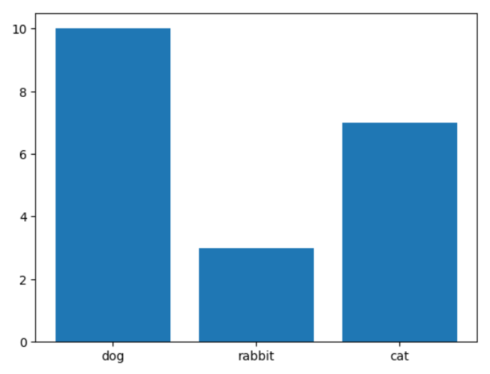

**Кругові діаграми (Pie charts) — просто скажіть «ні»**

Кругові діаграми призначені для представлення даних, а не для їх дослідження!

Люди не дуже добре оцінюють площу або кути (наприклад, важко визначити, чи один сегмент становить 23 %, а інший — 27 %). Стовпчасті діаграми набагато простіші, оскільки люди точніше порівнюють довжини.

Порівняти дві різні кругові діаграми (наприклад, два періоди часу) майже неможливо. Неможливо легко додати смуги похибки, опорні лінії або точні порівняння.

Ось приклад того, як побудувати кругову діаграму:

```
data = {"strongly disagree": 3,
        "disagree": 8,
        "neutral": 12,
        "agree": 11,
        "strongly agree": 4}

plt.pie(data.values(), labels=data.keys(), autopct='%1.1f%%')
plt.axis('equal')
```

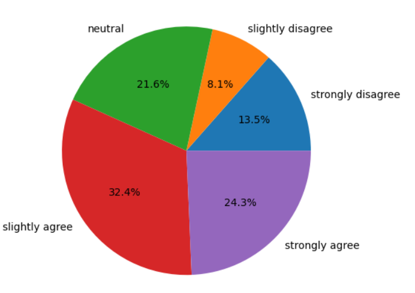


**Гістограми (Histograms) — числові дані**

```
np.random.seed(0)
data = np.concatenate([30 + 4*np.random.randn(5000),
                       22 + 2*np.random.randn(7000),
                       12 + 3*np.random.randn(3000)])
plt.hist(data, bins=50)


# data = np.concatenate([10 + 5*np.random.randn(10000)])
# plt.hist(data, bins=50);
```

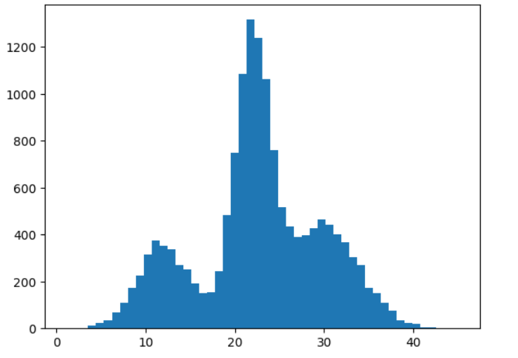


**2D дані**

**Точкові діаграми — числові x числові (Scatter plots — numeric x numeric)**

Якщо обидва виміри даних є числовими, найприроднішим першим типом діаграми, який слід розглянути, є точкова діаграма: нанесення точок, які просто відповідають різним координатам даних. (Діаграма розсіювання)

```
x = np.random.randn(1000)
y = 0.8*x**3 + x + 1.5*np.random.randn(1000)
plt.scatter(x,y,s=1)
```

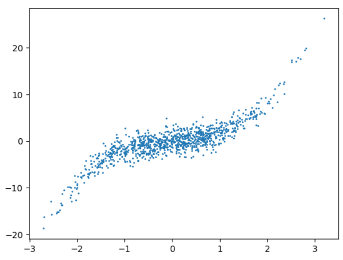


Однак існує також природний режим відмови, коли точок занадто багато, щоб їх можна було чітко розділити, і графік втрачає здатність показувати щільність даних. Наприклад, якщо у нас в 10 разів більше точок, графік вже не так чітко показує щільність у внутрішній частині «щільності».

У цьому випадку надлишку даних ми також можемо створити 2D гістограму даних (яка групує дані за обома вимірами) і вказати «висоту» кожного блоку за допомогою кольорової карти. Такі графіки можуть чіткіше вказувати щільність точок у регіонах, які в оригінальному графіку розсіювання мають суцільний колір. Ці 2D гістограми іноді також називають *тепловими картами* (heat maps), але ця назва часто конфліктує з подібними версіями, що використовуються для побудови 2D категоріальних даних, тому тут ми будемо використовувати термін *2D гістограма*.

```
x = np.random.randn(10000)
y = 0.8*x**3 + x + 1.5*np.random.randn(10000)
#plt.scatter(x,y,s=10)

plt.hist2d(x,y,bins=100);
plt.colorbar();
plt.set_cmap('hot')
```

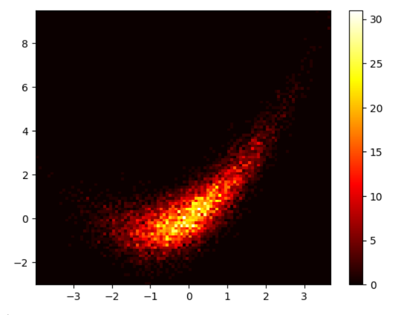


**Лінійна діаграма (line plot) - numeric x numeric (sequential)**


```
x = np.linspace(0,10,1000)
y = np.cumsum(0.01*np.random.randn(1000))
plt.plot(x,y)
```


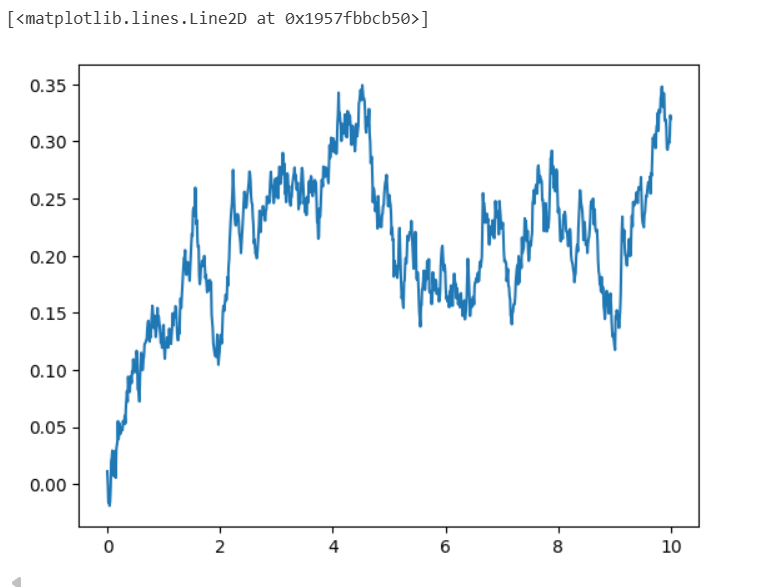


**Коробкова (Box and whiskers) і скрипкові діаграми (Violin plots) — категоріальні x числові**

Розглянемо простий приклад, де (тільки з вигаданими даними) ми будуємо графік учасників навчального процесу та їхній вік.

```
import numpy as np
import matplotlib.pyplot as plt
import scipy.linalg as la

data= {"student": 22 + 1.4*np.random.randn(1000),
       "teacher": 37 + 2.5*np.random.randn(900),
       "professor": 65 + 5.5*np.random.randn(300)}
plt.scatter(np.concatenate([i*np.ones(len(x)) for i,x in enumerate(data.values())]),
            np.concatenate(list(data.values())))
plt.xticks(range(len(data)), data.keys());
```

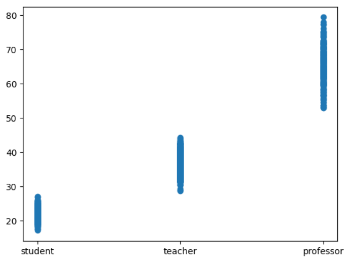


Очевидно, що, дивлячись тільки на цей графік, можна визначити дуже мало, оскільки в щільній лінії точок недостатньо інформації, щоб дійсно зрозуміти розподіл числової змінної для кожної точки. Поширеною стратегією тут є використання графіка коробкова, або коробка з вусами (box and whiskers), яка відображає медіану даних (як лінію в середині коробки), 25-й і 75-й процентилі даних (як нижня і верхня межі коробки), «вуса» встановлюються за допомогою ряду різних можливих угод (за замовчуванням Matplotlib використовує 1,5-кратний інтерквартильний розмах, відстань між 25-м і 75-м процентилем), а будь-які точки поза цим діапазоном («випадкові значення») відображаються окремо.

```
plt.boxplot(data.values())
plt.xticks(range(1,len(data)+1), data.keys())
```

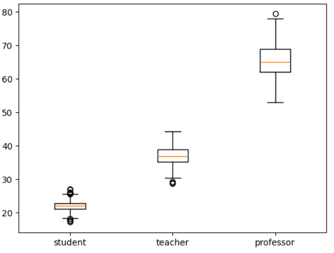


Звичайно, так само як середні значення та стандартні відхилення не описують повністю набір даних, статистика бокс-плат і вусів не відображає повністю розподіл даних. З цієї причини також часто використовуються скрипкові діаграми, які створюють міні-гістограми.

```
plt.violinplot(data.values())
plt.xticks(range(1,len(data)+1), data.keys())
```

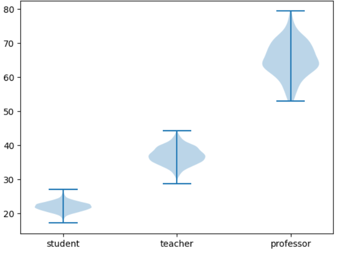


**Теплова карта (Heatmap) та бульбашкові діаграми (Bubble plots) — категоріальні x категоріальні**

Коли обидва виміри наших 2D-даних є категоріальними, ми маємо ще менше інформації для використання. Знову ж таки, метою буде надання певної інформації про загальну кількість усіх можливих комбінацій між двома наборами даних. Наприклад, розглянемо вигаданий набір даних про учасників навчального процесу та їхній улюблений спосіб навчання

```
types = np.array([('student', 'offline'), ('student', 'remote'), 
                  ('teacher', 'offline'), ('teacher', 'remote'), 
                  ('professor', 'offline'), ('professor', 'remote')])
data = types[np.random.choice(range(6), 2000, p=[0.4, 0.1, 0.12, 0.18, 0.05, 0.15]),:]

# print(data[100:])

label_x, x = np.unique(data[:,0], return_inverse=True)
label_y, y = np.unique(data[:,1], return_inverse=True)
M, xt, yt, _ = plt.hist2d(x,y, bins=(len(label_x), len(label_y)))
plt.xticks((xt[:-1]+xt[1:])/2, label_x)
plt.yticks((yt[:-1]+yt[1:])/2, label_y)
plt.colorbar()
```

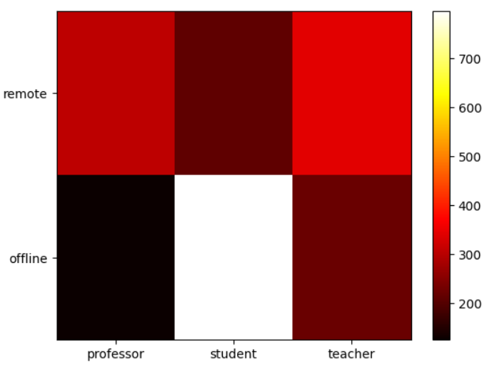


Хоча це може бути дещо корисним, діапазон кольорів, безперечно, не є дуже інформативним у деяких налаштуваннях, тому більш доречним може бути діаграма розсіювання з розмірами, пов'язаними з кожним типом даних (це також називається бульбашковою діаграмою).

```
xy, cnts = np.unique((x,y), axis=1, return_counts=True)
plt.scatter(xy[0], xy[1], s=cnts*5)
plt.xticks(range(len(label_x)), label_x)
plt.yticks(range(len(label_y)), label_y)
```

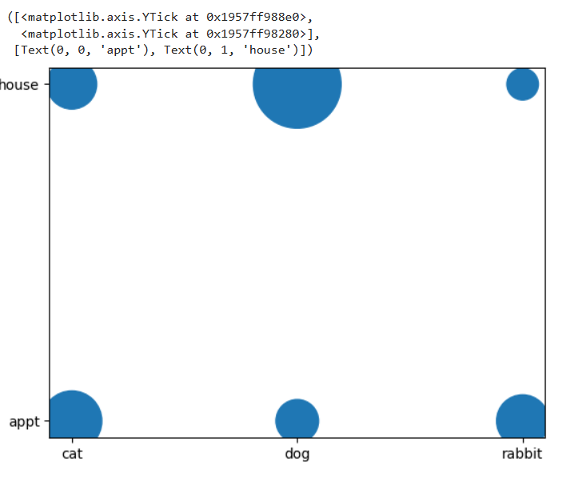


## 4. Лінійна алгебра та бібліотека NumPy

- Вектори та матриці відіграють центральну роль в інтелектуальному аналізі даних.
- Матриці - очевидний спосіб зберігання табличних даних.
- Основа лінійної алгебри, яка є мовою всіх алгоритмів аналізу даних (ml, ai тощо).


## 5. Теорія Графів 

## 6. Обробка Природної Мови (Natural Language Processing, NLP)

## 7. Теорія ймовірності


## 8. Вступ в машинне навчання

## 9. Лінійна Класифікація

## 10. Нелінійні Алгоритми Машинного Навчання

## 11. Ансамблеве навчання

## 12. Навчання без учителя (Unsupervised Learning)

## 13. Перевірка статистичних гіпотез (Hypothesis testing)

## 14. Рекомендаційні системи (Recommender Systems)

## 15. Часові Ряди

## 16. Моделювання Кризових Явищ

## 17. Використання нейронних мереж для аналізу даних

