# Інтелектуальний Аналіз Даних 

Навальний посібник 

Косович І. Т.
Матвій О. В. 
Мельник В. С.
Мельник Г. В.
Перцов А. С.

Чернівецький Національний Університет, 2026

## 1. Збір даних (Data Collection)

Першим кроком більшості процесів обробки даних є отримання даних. Дані, які ми зазвичай використовуємо, походять з багатьох різних джерел.

Якщо вам пощастить, хтось може безпосередньо надати вам файл, наприклад CSV. А іноді для збору відповідних даних потрібно буде виконати запит до бази даних . Але в цій лекції ми поговоримо про збір даних з двох основних джерел:

- запит до API (більшість з яких сьогодні є веб-орієнтованими); та
- вилучення даних з веб-сторінки.

**Збір даних з веб-джерел (Collecting data from web-based sources)**

Переважна більшість автоматизованих запитів даних, які ви будете виконувати, використовуватимуть HTTP-запити (це стало домінуючим протоколом не тільки для запитів веб-сторінок).

```
import requests
response = requests.get("https://fmi.chnu.edu.ua/")

print("Status Code:", response.status_code)
print("Headers:", response.headers)

print(response.text)
```

HTTP GET є найпоширенішим методом, але існують також методи PUT, POST, DELETE, які змінюють деякі параметри на сервері.

Параметри URL можна вказати за допомогою бібліотеки запитів, як показано нижче:

```
params = {"sa":"t", "rct":"j", "q":"", "esrc":"s",
"source":"web", "cd":"9", "cad":"rja", "uact":"8"}
response = requests.get("http://www.google.com/url", params=params)

print("Final URL:", response.url)
print(response.text)
```

**RESTful API**

Якщо ви перейдете від простого запиту веб-сторінок до веб-API, ви, швидше за все, зіткнетеся з REST API (Representational State Transfer). REST — це скоріше архітектура дизайну, але ось кілька ключових моментів:

Використовує стандартний інтерфейс і методи HTTP (GET, PUT, POST, DELETE)
Stateless – сервер не запам'ятовує, що ви робили
Практичне правило: якщо ви надсилаєте ключ свого облікового запису разом із кожним викликом API, ви, ймовірно, використовуєте REST API

Ви запитуєте REST API подібно до стандартних HTTP-запитів, але майже завжди потрібно включати параметри

Отримайте власний токен доступу на https://github.com/settings/tokens/new GitHub API використовує GET/PUT/DELETE, щоб ви могли автоматично запитувати або оновлювати елементи у вашому обліковому записі GitHub Приклад REST: сервер не запам'ятовує ваші останні запити, наприклад, ви завжди повинні включати свій токен доступу, якщо використовуєте його таким чином

```
import os
from dotenv import load_dotenv

load_dotenv()
token = os.getenv("GITHUB_TOKEN")

headers = {'Authorization': 'Bearer '+token}
response = requests.get("https://api.github.com/user", headers=headers)
print(response.content)
```

**CSV-файли**

CSV: Відноситься до будь-якого текстового файлу з роздільниками (не завжди розділеного комами).

Якщо самі значення містять коми, ви можете взяти їх у лапки (наш реєстратор, очевидно, завжди так робить, щоб бути впевненим).


```
import pandas as pd

dataframe = pd.read_csv("../resources/bitcoin.csv", delimiter=',', quotechar='"')
dataframe.head(10)
```

**Парсинг JSON в Python**

Вбудована бібліотека для читання/запису об'єктів Python з/у файли JSON

```
import json
# load json from a REST API call

headers = {'Authorization': 'token ' + token}
response = requests.get("https://api.github.com/user", headers=headers)
data = json.loads(response.content)

#json.load(file) # load json from file
json.dumps(data) # return json string
#json.dump(obj, file) # write json to file
```

**Парсинг XML/HTML в Python**

Існує ряд XML/HTML-парсерів для Python, але для науки про дані добре підходить бібліотека BeautifulSoup (спеціально призначена для вилучення даних з XML/HTML-файлів).

```
# get all the links within the webpage
from bs4 import BeautifulSoup
import requests

response = requests.get("https://fmi.chnu.edu.ua/")

root = BeautifulSoup(response.content)
root.find("div").findAll("a")
```

**Регулярні вирази (Regular expressions)**

Після завантаження даних (або якщо вам потрібно створити парсер для завантаження даних іншого формату) часто доводиться шукати певні елементи в даних.

Наприклад, знайти перше входження рядка «data science»

```
import re
text = "This course will introduce the basics of data science"
match = re.search(r"data science", text)
print(match.start())
print(re.match(r"This", text))

# Regular expressions in Python

match = re.match(r"data science", text) # check if start of text matches
match = re.search(r"data science", text) # find first match or None

all_matches = re.findall(r"a", text) # return all matches
print(all_matches)
```

**Відповідність декількох потенційних символів (Matching multiple potential characters)**

Справжня сила регулярних виразів полягає в можливості збігу декількох можливих послідовностей символів. Спеціальні символи в регулярних виразах: `.^$*+?{}\[]|()` (якщо ви хочете, щоб ці символи збігалися точно, вам потрібно їх екранувати: `\$`)

Відповідність наборів символів:

- Відповідність символу «a»: `a`
- Відповідність символів «a», «b» або «c»: `[abc]`
- Будь-який символ, крім «a», «b» або «c»: `[^abc]`
- Відповідність будь-якої цифри: `\d` (те саме, що `[0-9]`)
- Відповідність будь-якого алфавітно-цифрового символу: `\w` (те саме, що `[a-zA-z0-9_]`)
- Відповідність пробілу: `\s` (те саме, що `[ \t\n\r\f\v]`)
- Відповідність будь-якого символу: `.` (включно з новою лінією з re.DOTALL)

Може збігатися з одним або декількома випадками символу (або набору символів)

Деякі поширені модифікатори:

- Відповідність символу «a» рівно один раз: `a`
- Відповідність символу «a» нуль або один раз: `a?`
- Відповідність символу «a» нуль або більше разів: `a*`
- Відповідність символу «a» один або більше разів: `a+`
- Відповідність символу «a» рівно n разів: `a{n}`

Можна поєднувати їх із збігом декількох символів:

- Відповідність усіх випадків «`<something>` science», де `<something>` — це алфавітно-цифровий рядок, що містить принаймні один символ:
`\w+\s+science`


## 2. Data Processing

**Pandas**

Існує ряд бібліотек Python, які обробляють реляційні дані, зазвичай написані як інтерфейси до декількох різних систем управління реляційними базами даних (таких як PostgreSQL, MySQL та інші). [Примітка: слід зазначити, що програмне забезпечення, таке як PostreSQL і MySQL, правильніше називати системами управління реляційними базами даних (RDBMS), а не базами даних. База даних — це фактичні таблиці та записи, що визначають фактичну сукупність даних.

Однак у цьому курсі ми будемо працювати з реляційними даними переважно за допомогою двох бібліотек: Pandas і SQLite. Це особливо прості бібліотеки, якщо говорити про реальні бази даних: Pandas, безумовно, не є реальною системою реляційних баз даних (хоча вона надає функції, що віддзеркалюють деякі їхні можливості), тоді як SQLite є «реальною» RDBMS, але надзвичайно простою, без стандартної архітектури клієнт/сервер, яка є практично у всіх реальних виробничих базах даних. Проте для багатьох задач у галузі науки про дані вони будуть достатніми, тому ми зосередимося на них тут.

Ми вже коротко розглянули Panda, коли обговорювали збір даних, і вона виявилася однією з найкорисніших бібліотек Python для науки про дані. Як ми вже згадували вище (але будемо повторювати цей факт багато разів), Pandas — це не бібліотека реляційних баз даних, а бібліотека «даних-рам». Ви можете уявити собі фрейм даних як 2D-масив, за винятком того, що записи у фреймі даних можуть бути будь-яким типом об'єкта Python (і мати змішані типи в масиві), а рядки/стовпці можуть мати «мітки» замість цілочисельних індексів, як у стандартному масиві.

Давайте подивимося, як спочатку створити фрейм даних у Pandas, який відображає нашу таблицю Person вище (ми залишимо стовпець «Role ID» поза увагою, щоб спростити завдання).


## 3. Візуалізація даних (Data visualization)

Важливо підкреслити різницю між двома дуже різними поняттями, які люди описують, використовуючи загальний термін «візуалізація». Перше з них — «візуалізація для дослідження даних»: використання візуалізації для розуміння (тобто для власного розуміння) сукупності даних з метою подальшого аналізу. Коротко кажучи, мета цього типу візуалізації — «знайти істину» в даних. Альтернативою є «візуалізація для презентації»: виокремлення певного аспекту даних у вигляді зрозумілої діаграми або графіку, що передає широкій аудиторії конкретний аспект даних, який ви хочете донести. Цей тип візуалізації має на меті «переконати інших людей у правдивості ваших висновків».

*Візуалізація VS статистика:* Візуалізація майже завжди надає більш інформативний (хоча і менш кількісний) огляд ваших даних, ніж статистика (підхід, а не галузь науки в цілому).

**Типи даних (Types of data)**

Чотири основні типи даних:

- *Номінальні дані (Nominal data)*: категоріальні дані без внутрішнього порядку між категоріями. Наприклад, змінна «тип домашньої тварини» може складатися з класів {собака, кіт, кролик}, і між цими двома типами немає відносного порядку, це просто різні дискретні значення.

- *Порядкові дані (Ordinal data)*: категоріальні дані з внутрішньою послідовністю, але «відмінності» між категоріями не мають суто числового значення. Канонічним прикладом тут є відповіді на опитування з такими відповідями: {категорично не згоден, трохи не згоден, нейтральний, трохи згоден, категорично згоден}. Важливою особливістю тут є те, що, хоча між цими типами існує чітка послідовність, немає сенсу вважати, що різниця між «трохи згоден» і «категорично згоден» є «такою ж», як різниця між «нейтральний» і «трохи згоден».

- *Інтервальні дані (Interval data)*: числові дані, тобто дані, які можна відобразити на «числовій прямій»; важливим аспектом на відміну від порядкових даних є не «дискретна проти безперервної диференціації» (наприклад, цілочисельні значення можна вважати інтервальними даними), а той факт, що відносні відмінності в інтервальних даних мають значення. Класичним прикладом є температура (у Фаренгейті або Цельсії, що ми підкреслимо трохи пізніше): тут різниці між температурами мають значення: 10 і 15 градусів розділені такою ж величиною, як 15 і 20 (ця властивість настільки властива числовим даним, що майже дивно її підкреслювати). З іншого боку, інтервальні дані охоплюють випадки, коли нульова точка «не має реального значення»; на практиці це означає, що співвідношення між двома точками даних не має значення. Двадцять градусів за Фаренгейтом не є «вдвічі гарячішими» в будь-якому значущому сенсі, ніж 10 градусів; і, звичайно, не нескінченно гарячішими, ніж нуль градусів.

- *Дані про співвідношення (Ratio data)*: також числові дані, але співвідношення між вимірами має певне значення. Класичним прикладом тут є температура за Кельвіном. Очевидно, що, як і температура за Фаренгейтом або Цельсієм, це описує основне явище температури, але на відміну від попередніх випадків, нуль за Кельвіном має значення з точки зору молекулярної енергії в речовині (тобто її відсутність). Це означає, що співвідношення мають реальне значення: речовина при 20 градусах Кельвіна має вдвічі більше кінетичної енергії на молекулярному рівні, ніж та сама речовина при 10 градусах Кельвіна.

«Допустимі операції», які ми можемо виконувати над двома даними різних типів:

Номінальні дані: =,≠. Все, що ми можемо зробити з номінальними даними, це порівняти два дані та перевірити, чи вони рівні.

Порядкові дані: =,≠,<,>. Окрім перевірки на рівність, ми також можемо порівнювати порядок різних точок даних.

Інтервальні дані: =,≠,<,>,−. Ми маємо всі операції з порядковими даними, але також можемо обчислювати точні числові різниці між двома точками даних. Залежно від контексту, ми можемо сказати, що додавання також дозволено, але іноді додавання фактично передбачає нульову точку і тому застосовується тільки до даних про співвідношення.

Дані співвідношення: =,≠,<,0,−,+,÷. Ми маємо всі операції з інтервальними даними, але додавання тепер практично завжди дозволено, і ми можемо додатково виконувати ділення (для визначення співвідношень) між різними точками даних.

**Коротко**:

Номінальні: категоріальні дані, без упорядкування Приклад – Домашні тварини: {собака, кіт, кролик, …} Операції: =, ≠

Порядкові: категоріальні дані, з упорядкуванням Приклад – Рейтинг: {«поганий»,«нейтральний»,“хороший”,«дуже хороший»} Операції: =, ≠, ≥, ≤, >, <

Інтервал: числові дані, нуль не означає нульову «кількість» Приклад – температура за Фаренгейтом, Цельсієм Операції: = , ≠, ≥, ≤, >, <, +, −

Співвідношення: числові дані, нуль має значення, пов'язане з нульовою «кількістю» Приклад – температура за Кельвіном Операції: = , ≠, ≥, ≤, >, <, +, −,÷

**Побудова графіків різних типів даних**

Щоб бути більш формальними, далі ми припускаємо, що маємо доступ до набору даних, який можна позначити як

$\{x^{(1)},x^{(2)},…,x^{(m)}\}$

де кожне $x^{(i)}$ є деякою точкою даних. $x^{(i)}=(a_{1}^{i}, a_{2}^{i}, a_{3}^{i}, ...)$

Для побудови всіх цих графіків ми будемо використовувати бібліотеку matplotlib, яка добре інтегрується з Jupyter notebook.

**1D дані**

**Стовпчасті діаграми (Bar charts) — категоріальні дані**

Якщо ваші дані є одновимірними категоріальними, єдиним реальним варіантом для їх візуалізації є використання стовпчастої діаграми. Зверніть увагу, що, виходячи з нашого припущення про те, що порядок точок даних у нашому наборі даних не має значення, єдиною значущою інформацією, якщо ми маємо набір даних типу

$\{student,teacher,student,professor,teacher,student,…\}$

буде кількість повторень кожного елемента. Таким чином, ми можемо ефективно узагальнити дані, включивши кількість повторень кожного значення даних (це легко зробити за допомогою класу `collections.Counter`).

Примітка: незважаючи на те, що ви, можливо, бачили на деяких рисунках, зверніть увагу, що включення ліній між різними стовпчиками однозначно не має сенсу.

```
import collections
import matplotlib.pyplot as plt
import numpy as np

data = np.random.permutation(np.array(["student"]*15 + ["teacher"]*7 + ["professor"]*3))
# print(data)
counts = collections.Counter(data)
plt.bar(range(len(counts)), list(counts.values()), tick_label=list(counts.keys()))
```

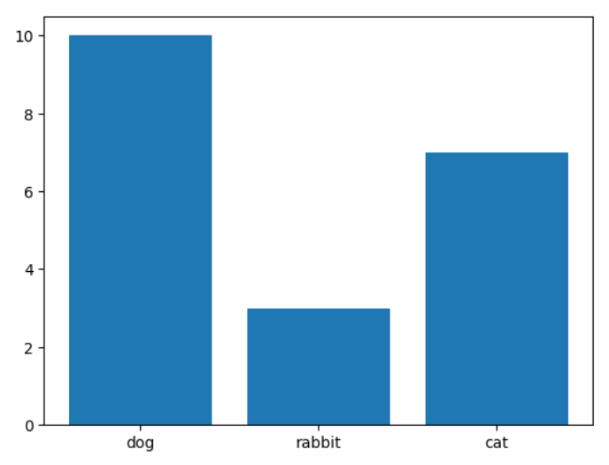

**Кругові діаграми (Pie charts) — просто скажіть «ні»**

Кругові діаграми призначені для представлення даних, а не для їх дослідження!

Люди не дуже добре оцінюють площу або кути (наприклад, важко визначити, чи один сегмент становить 23 %, а інший — 27 %). Стовпчасті діаграми набагато простіші, оскільки люди точніше порівнюють довжини.

Порівняти дві різні кругові діаграми (наприклад, два періоди часу) майже неможливо. Неможливо легко додати смуги похибки, опорні лінії або точні порівняння.

Ось приклад того, як побудувати кругову діаграму:

```
data = {"strongly disagree": 3,
        "disagree": 8,
        "neutral": 12,
        "agree": 11,
        "strongly agree": 4}

plt.pie(data.values(), labels=data.keys(), autopct='%1.1f%%')
plt.axis('equal')
```

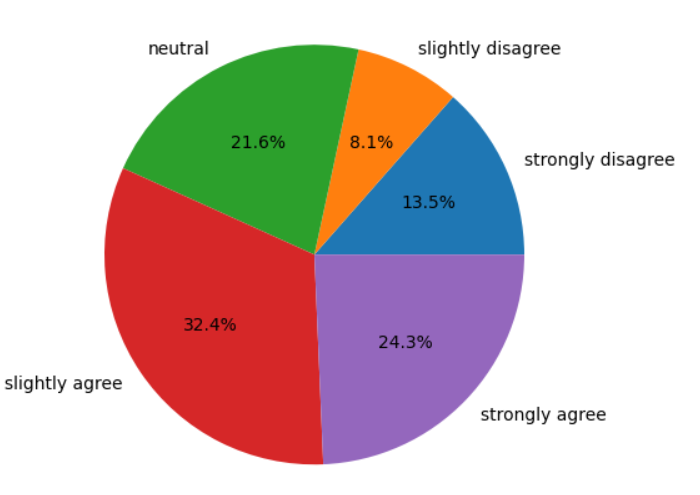


**Гістограми (Histograms) — числові дані**

```
np.random.seed(0)
data = np.concatenate([30 + 4*np.random.randn(5000),
                       22 + 2*np.random.randn(7000),
                       12 + 3*np.random.randn(3000)])
plt.hist(data, bins=50)


# data = np.concatenate([10 + 5*np.random.randn(10000)])
# plt.hist(data, bins=50);
```

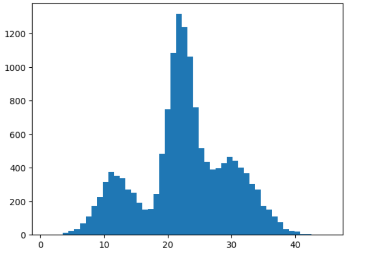


**2D дані**

**Точкові діаграми — числові x числові (Scatter plots — numeric x numeric)**

Якщо обидва виміри даних є числовими, найприроднішим першим типом діаграми, який слід розглянути, є точкова діаграма: нанесення точок, які просто відповідають різним координатам даних. (Діаграма розсіювання)

```
x = np.random.randn(1000)
y = 0.8*x**3 + x + 1.5*np.random.randn(1000)
plt.scatter(x,y,s=1)
```

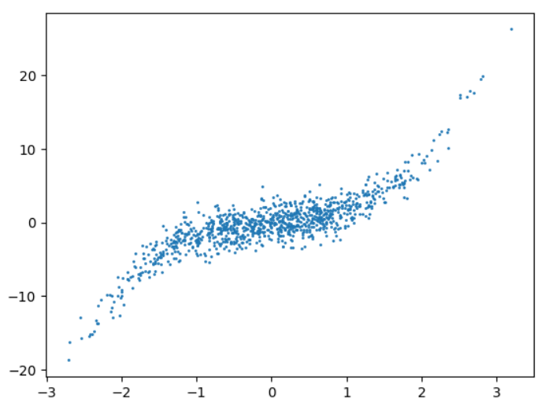


Однак існує також природний режим відмови, коли точок занадто багато, щоб їх можна було чітко розділити, і графік втрачає здатність показувати щільність даних. Наприклад, якщо у нас в 10 разів більше точок, графік вже не так чітко показує щільність у внутрішній частині «щільності».

У цьому випадку надлишку даних ми також можемо створити 2D гістограму даних (яка групує дані за обома вимірами) і вказати «висоту» кожного блоку за допомогою кольорової карти. Такі графіки можуть чіткіше вказувати щільність точок у регіонах, які в оригінальному графіку розсіювання мають суцільний колір. Ці 2D гістограми іноді також називають *тепловими картами* (heat maps), але ця назва часто конфліктує з подібними версіями, що використовуються для побудови 2D категоріальних даних, тому тут ми будемо використовувати термін *2D гістограма*.

```
x = np.random.randn(10000)
y = 0.8*x**3 + x + 1.5*np.random.randn(10000)
#plt.scatter(x,y,s=10)

plt.hist2d(x,y,bins=100);
plt.colorbar();
plt.set_cmap('hot')
```

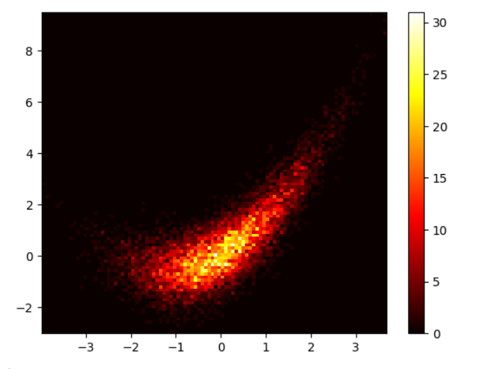


**Лінійна діаграма (line plot) - numeric x numeric (sequential)**


```
x = np.linspace(0,10,1000)
y = np.cumsum(0.01*np.random.randn(1000))
plt.plot(x,y)
```


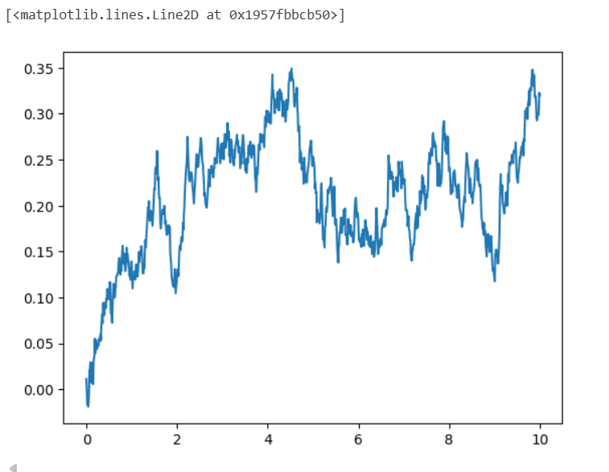


**Коробкова (Box and whiskers) і скрипкові діаграми (Violin plots) — категоріальні x числові**

Розглянемо простий приклад, де (тільки з вигаданими даними) ми будуємо графік учасників навчального процесу та їхній вік.

```
import numpy as np
import matplotlib.pyplot as plt
import scipy.linalg as la

data= {"student": 22 + 1.4*np.random.randn(1000),
       "teacher": 37 + 2.5*np.random.randn(900),
       "professor": 65 + 5.5*np.random.randn(300)}
plt.scatter(np.concatenate([i*np.ones(len(x)) for i,x in enumerate(data.values())]),
            np.concatenate(list(data.values())))
plt.xticks(range(len(data)), data.keys());
```

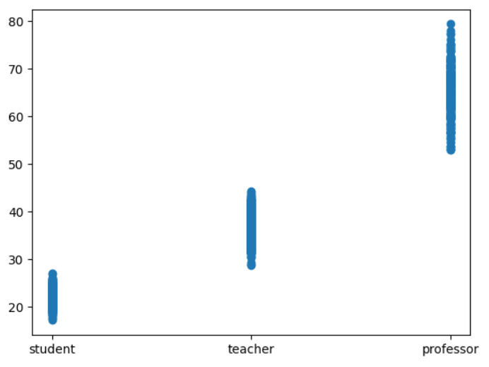


Очевидно, що, дивлячись тільки на цей графік, можна визначити дуже мало, оскільки в щільній лінії точок недостатньо інформації, щоб дійсно зрозуміти розподіл числової змінної для кожної точки. Поширеною стратегією тут є використання графіка коробкова, або коробка з вусами (box and whiskers), яка відображає медіану даних (як лінію в середині коробки), 25-й і 75-й процентилі даних (як нижня і верхня межі коробки), «вуса» встановлюються за допомогою ряду різних можливих угод (за замовчуванням Matplotlib використовує 1,5-кратний інтерквартильний розмах, відстань між 25-м і 75-м процентилем), а будь-які точки поза цим діапазоном («випадкові значення») відображаються окремо.

```
plt.boxplot(data.values())
plt.xticks(range(1,len(data)+1), data.keys())
```

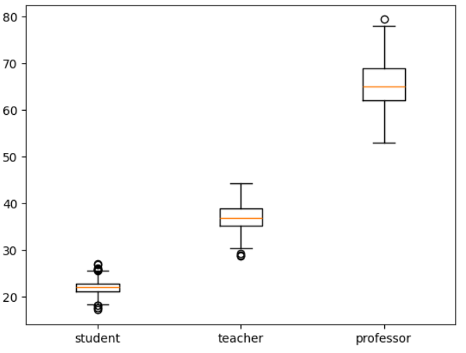


Звичайно, так само як середні значення та стандартні відхилення не описують повністю набір даних, статистика бокс-плат і вусів не відображає повністю розподіл даних. З цієї причини також часто використовуються скрипкові діаграми, які створюють міні-гістограми.

```
plt.violinplot(data.values())
plt.xticks(range(1,len(data)+1), data.keys())
```

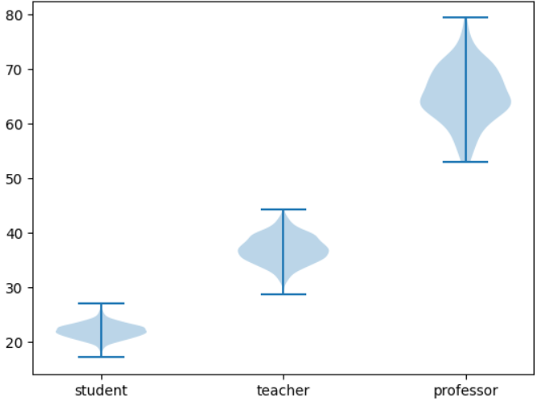


**Теплова карта (Heatmap) та бульбашкові діаграми (Bubble plots) — категоріальні x категоріальні**

Коли обидва виміри наших 2D-даних є категоріальними, ми маємо ще менше інформації для використання. Знову ж таки, метою буде надання певної інформації про загальну кількість усіх можливих комбінацій між двома наборами даних. Наприклад, розглянемо вигаданий набір даних про учасників навчального процесу та їхній улюблений спосіб навчання

```
types = np.array([('student', 'offline'), ('student', 'remote'), 
                  ('teacher', 'offline'), ('teacher', 'remote'), 
                  ('professor', 'offline'), ('professor', 'remote')])
data = types[np.random.choice(range(6), 2000, p=[0.4, 0.1, 0.12, 0.18, 0.05, 0.15]),:]

# print(data[100:])

label_x, x = np.unique(data[:,0], return_inverse=True)
label_y, y = np.unique(data[:,1], return_inverse=True)
M, xt, yt, _ = plt.hist2d(x,y, bins=(len(label_x), len(label_y)))
plt.xticks((xt[:-1]+xt[1:])/2, label_x)
plt.yticks((yt[:-1]+yt[1:])/2, label_y)
plt.colorbar()
```

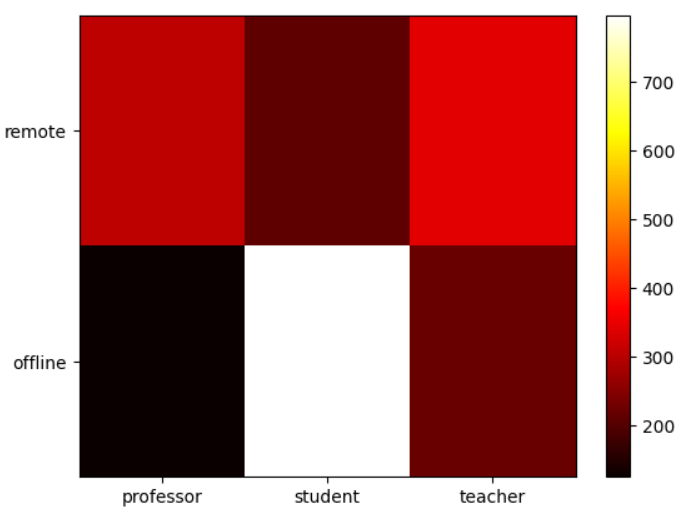


Хоча це може бути дещо корисним, діапазон кольорів, безперечно, не є дуже інформативним у деяких налаштуваннях, тому більш доречним може бути діаграма розсіювання з розмірами, пов'язаними з кожним типом даних (це також називається бульбашковою діаграмою).

```
xy, cnts = np.unique((x,y), axis=1, return_counts=True)
plt.scatter(xy[0], xy[1], s=cnts*5)
plt.xticks(range(len(label_x)), label_x)
plt.yticks(range(len(label_y)), label_y)
```

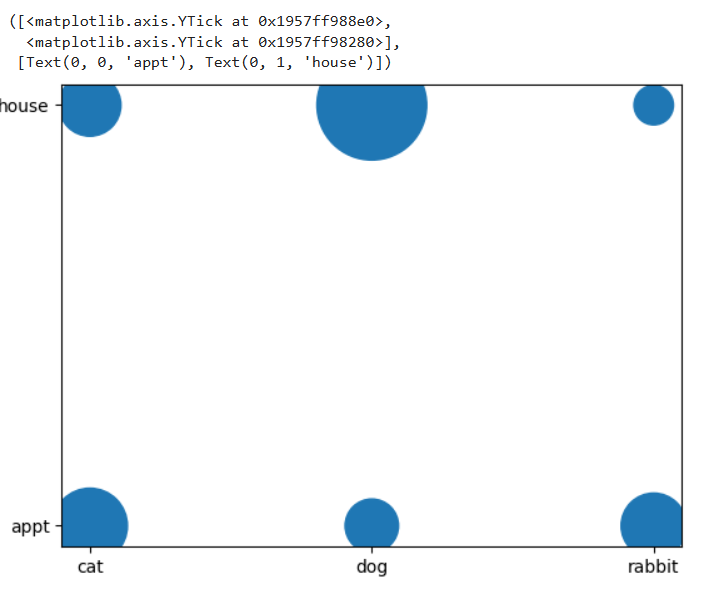

**3D дані**

Як тільки ми виходимо за межі двох вимірів, ефективна візуалізація стає набагато складнішою.

3D точкові графіки (3D scatter plots): cлід уникати, якщо не можна взаємодіяти з 3D-графіком:

```
x = np.random.randn(1000)
y = 0.4*x**3 + x + 1.7*np.random.randn(1000)
z = 0.5 + 0.1*(y-1)**2 + 0.4*np.random.randn(1000)

from mpl_toolkits.mplot3d import Axes3D
fig = plt.figure()
ax = fig.add_subplot(111, projection='3d')
ax.scatter(x,y,z)
```

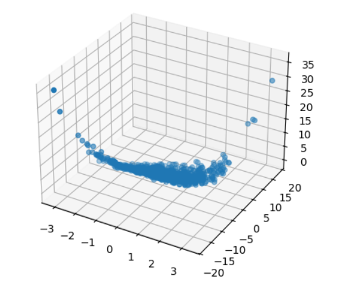


**Матриці розсіювання (точкові матриці) (scatter matrices)**

Універсальним засобом для візуалізації високорозмірних даних є матриця розсіювання.

Щодо матриць розсіювання слід зазначити один важливий момент: не намагайтеся використовувати їх для представлення даних.


```
import pandas as pd
df = pd.DataFrame([x,y,z]).transpose()
pd.plotting.scatter_matrix(df, hist_kwds={'bins':50})
```

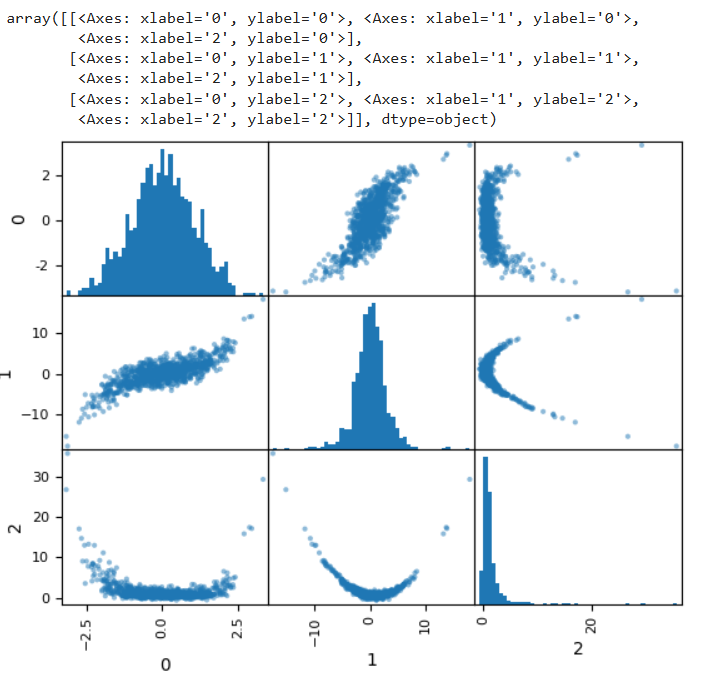


**Бульбашкові діаграми (Bubble plots)**

Бульбашкова діаграма з попереднього розділу також може бути одним із засобів розуміння тривимірних даних. У цій діаграмі та її варіантах ми побудуємо двовимірну точкову діаграму, але додамо третій вимір за допомогою іншого атрибуту, наприклад розміру точок. Для наведених вище даних це буде виглядати наступним чином.

```
plt.scatter(x,y,s=z*20)
```

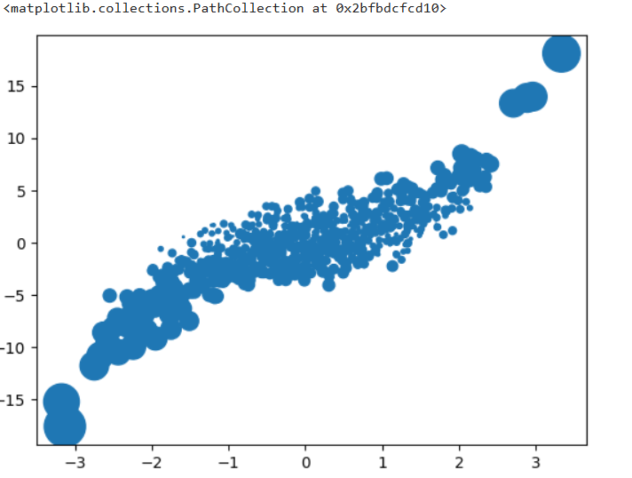


```
plt.scatter(x,y,c=z)
```

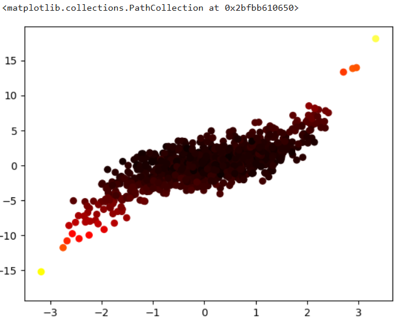

## 4. Лінійна алгебра та бібліотека NumPy

Вектори та матриці відіграють центральну роль в сучасному інтелектуальному аналізі даних. Матриці, це очевидний спосіб зберігання табличних даних. Сьогодні основа лінійної алгебри, є мовою всіх алгоритмів аналізу даних (машинне навчання, штучний інтелект та ін.).

*Вектор* - 1D масив даних 

$\mathbf{v} = \begin{bmatrix} x_1 \\ x_2 \\ ... \\ x_n \end{bmatrix}$

*Матриця* - 2D масив даних

$$
\mathbf{A} = \begin{bmatrix}
x_{11} & x_{12} & ... & x_{1m} \\
x_{21} & x_{22} & ... & x_{2m} \\
... & ... & ... & ... \\
x_{n1} & x_{n2} & ... & x_{nm}
\end{bmatrix}
$$

Існують також узагальнення матриць вищого порядку (так звані *тензори*), які представляють тривимірні або вищі масиви значень. Вони досить широко використовуються в сучасній науці про дані, хоча зазвичай (але, звичайно, не завжди) тензори використовуються лише в значенні «багатовимірного масиву», а не в їхньому справжньому лінійно-алгебраїчному значенні. Тензори як лінійні оператори, що діють, наприклад, на матриці або інші тензори вищого порядку, дещо рідше використовуються в базовій науці про дані.

**Порядок рядків і стовпців**

Матриці можуть бути розміщені в пам'яті за рядками або за стовпцями.

$$
\mathbf{A} = \begin{bmatrix}
100 & 80 \\
60 & 80 \\
100 & 100
\end{bmatrix}
$$

За рядками: 100, 80, 60, 80, 100, 100. За стовпцями: 100, 60, 100, 80, 80, 100. По замовчуванню в NumPy порядок за рядками

*Основні операції*

**Додавання**: Дві матриці A та B, $[n\times m]$, $A+B=C$ визначається: $C_{ij}=A_{ij}+B_{ij}$

**Транспонування**: Для матриці $A$, $[n\times m]$, транспонована матриця $C=A^{T}$ визначається: $C_{ij}=A_{ji}$

**Множення**: Для матриць $A$ ($[n\times m]$) та $B$ ($[m\times p]$) добуток $C=AB$ ($[n\times p]$) визначається: $C_{ij}=\sum_{k=1}^{m}A_{ik}B_{kj}$

Множення матриць є асоціативним ($(AB)C=A(BC)$), дистрибутивним $A(B+C)=AB+AC$, але не комутативним ($AB\neq BA$).

**Одинична матриця**: Одинична матриця I це квадратна матриця з одиницями на головній діагоналі та нулями в інших позиціях:

$$
\mathbf{I} = \begin{bmatrix}
1 & 0 & ... & 0 \\
0 & 1 & ... & 0 \\
... & ... & ... & ... \\
0 & 0 & ... & 1
\end{bmatrix}
$$

Для будь-якої матриці $A$: $AI=IA=A$

**Обернена матриця**: Для квадратної матриці $A$, обернена матриця $A^{−1}$ це така матриця, що

$A^{−1}A=AA^{−1}=I$

Не для кожної квадратної матриці існує обернена.

Деякі рівняння: $(AB)^{T}=B^{T}A^{T}$, $(AB)^{-1}=B^{-1}A^{-1}$

Скалярний добуток векторів: $x*y$ = $x^{T}y = \sum_{i=1}^{n}x_{i}y_{i}$;

Норма вектора: $||x||_{2} = \sqrt{\sum_{i=1}^{n}x_{i}^{2}}$

**Масиви Numpy**

Створення масиву за допомогою команди `numpy.array` повертає тип `ndarray`. Ви також можете створювати масиви нулів, одиниць або випадкових чисел (у цьому випадку `np.randon.randn` створює матрицю зі стандартними випадковими нормальними елементами, а `np.random.rand` створює рівномірні випадкові елементи).

```python
import numpy as np

b = np.array([-13,9])           
A = np.array([[4,-5], [-2,3]])   
print(b, "\n")
print(A, "\n")

print(np.ones(40), "\n")           # 1D масив одиниць
print(np.zeros(4), "\n")          # 1D масив нулів
print(np.random.rand(40), "\n")         # 1D масив сипадкових чисел нормального розподілу

print(np.ones((3,4)), "\n")       # 2D масив одиниць
print(np.zeros((3,4)), "\n")      # 2D масив нулів
print(np.random.randn(3,4))       # 2D масив випадкових чисел нормального розподілу

sigma, mu = 10, 50
print(sigma * np.random.randn(10,10) + mu)  # 2D масив випадкових чисел нормального розподілу із середнім значенням mu та дисперсією sigma
```

Ви також можете створити матрицю ідентичності за допомогою команди `np.eye()`, а діагональну матрицю — за допомогою команди `np.diag()`.

```python
print(np.eye(3),"\n")                     # створити масив для одиничної матриці 3x3 
print(np.diag(np.random.randn(3)),"\n")   # створити діагональний масив випадкових чисел нормального розподілу
```

Вивід:

```
[[1. 0. 0.]
 [0. 1. 0.]
 [0. 0. 1.]] 

[[ 0.50651677  0.          0.        ]
 [ 0.         -0.35063699  0.        ]
 [ 0.          0.         -0.72949183]] 
```


**Індексація в масивах numpy**

```python
A = np.array([[1,2,3], [4,5,6], [7,8,9], [10, 11, 12]])
print(A, "\n")
print(A[1,1],"\n")           # вибрати один запис
print(A[1,:],"\n")           # вибрати ряд
print(A[1:3, :], "\n")       # slice 
```

Вивід:

```
[[ 1  2  3]
 [ 4  5  6]
 [ 7  8  9]
 [10 11 12]] 

5 

[4 5 6] 

[[4 5 6]
 [7 8 9]] 

```


```python
print(A[1:2,1:2], "\n")  # Вибрати A[1,1] як одиничний 2D масив
print(A[[1,2,3],:], "\n")  # вибрати рядки 1, 2, та 3
print(A[[2,1,2],:], "\n")  # вибрати рядки 2, 1, та 2 знову
print(A[[False, True, False, True],:], "\n")  # Вибрати 1-й та 3-й рядки
```

Вивід:

```
[[5]] 

[[ 4  5  6]
 [ 7  8  9]
 [10 11 12]] 

[[7 8 9]
 [4 5 6]
 [7 8 9]] 

[[ 4  5  6]
 [10 11 12]] 
```


*Основні операції над масивами*: масиви можна додавати/віднімати, множити/ділити та транспонувати, але ці операції **не є ідентичними** до відповідних операцій у лінійній алгебрі.
Множення та ділення масивів виконуються **поелементно**, вони **не** є множенням матриць або чимось, пов'язаним з оберненням матриць.

```python
A = np.array([[1,2,3], [4,5,6], [7,8,9], [10, 11, 12]])
B = np.array([[1, 1, 1], [1,2,1], [3, 1, 3], [1, 4, 1]])

print(A+B, "\n") # додати A та B поелементно 
print(A-B, "\n") # відняти B від A поелементно (same as "standard" matrix subtraction)
print(A*B, "\n") # поелементне множення, не(!) множення матриць
print(A/B, "\n") # поелементне ділення
```

Вивід:

```
[[ 2  3  4]
 [ 5  7  7]
 [10  9 12]
 [11 15 13]] 

[[ 0  1  2]
 [ 3  3  5]
 [ 4  7  6]
 [ 9  7 11]] 

[[ 1  2  3]
 [ 4 10  6]
 [21  8 27]
 [10 44 12]] 

[[ 1.          2.          3.        ]
 [ 4.          2.5         6.        ]
 [ 2.33333333  8.          3.        ]
 [10.          2.75       12.        ]] 
```

Ви можете транспонувати масиви, але зверніть увагу, що це має значення тільки для 2D (або вищих) масивів. Транспонування 1D масиву нічого не дає, оскільки Numpy не розрізняє стовпцеві вектори та рядкові вектори для 1D масивів.


```python
print(A, "\n")
print(A.T, "\n")
```

Вивід:

```
[[ 1  2  3]
 [ 4  5  6]
 [ 7  8  9]
 [10 11 12]] 

[[ 1  4  7 10]
 [ 2  5  8 11]
 [ 3  6  9 12]] 
```


**Трансляція Numpy (broadcasting)**. Справжня цікавість починається, коли ви додаєте/віднімаєте/множите/ділите масиви різних розмірів. Замість того, щоб видавати помилку, Numpy спробує зрозуміти вашу операцію, використовуючи правила трансляції Numpy. Це складна тема, яка часто бентежить новачків у Numpy, але з невеликою практикою правила стають досить інтуїтивними.


```python
A = np.ones((4,3))          # A - 4x3
x = np.array([[1,2,3]])      # x - 1x3

print(A, '\n')
print(x, '\n')

print(A*x) # повторити x 4 рази, та помножити A
```

Вивід:

```
[[1. 1. 1.]
 [1. 1. 1.]
 [1. 1. 1.]
 [1. 1. 1.]] 

[[1 2 3]] 

[[1. 2. 3.]
 [1. 2. 3.]
 [1. 2. 3.]
 [1. 2. 3.]]
```

**Операції лінійної алгебри.** Починаючи з Python 3, між масивами numpy тепер існує оператор множення матриць `@` (раніше для цього доводилося використовувати більш громіздку функцію `np.dot()`).


```python
A = np.random.randn(5,4)
C = np.random.randn(4,3)
x = np.random.randn(4)
y = np.random.randn(5)
z = np.random.randn(4)

print(A @ C, "\n")       # множення матриці на матрицю (вертає 2D масив)
print(A @ x, "\n")       # множення матриці на вектор (вертає 1D масив)
print(x @ z)       # внутрішній добуток (скалярний) - зверніть увагу на тип даних, що вертаються - це скаляр, а не масив!
```

Вивід:

```
[[-0.77983164  0.86915701  0.74016041]
 [ 0.9441811  -1.13337787 -2.45126146]
 [ 1.06065113 -3.17950771 -3.50084458]
 [ 1.26732128 -1.3041138  -2.5499486 ]
 [ 1.60891994 -4.68541868 -4.6433185 ]] 

[ 1.53587182 -2.9122003  -2.53401694 -2.88846645 -3.50775768] 

2.236322572387176
```

*Зверніть увагу!* За замовчуванням оператор @ застосовується зліва направо, що може призвести до дуже неефективних порядків множення матриць.


```python
A = np.random.randn(1000,1000)
B = np.random.randn(1000,2000)
x = np.random.randn(2000)

%timeit A @ B @ x
```

Вивід:

```
59.1 ms ± 7.45 ms per loop (mean ± std. dev. of 7 runs, 10 loops each)
```

Це виконує матричні добутки $(AB)x$, які спочатку обчислюють неефективне множення матриць. Якщо ми хочемо обчислити добуток у набагато ефективнішому (в даному прикладі) порядку $A(Bx)$, ми використаємо команду

```python
%timeit A @ (B @ x)
```

```
2.13 ms ± 226 µs per loop (mean ± std. dev. of 7 runs, 100 loops each)
```

Нарешті, Numpy включає процедуру `np.linalg.inv()` для обчислення оберненої матриці $A^{−1}$ та `np.linalg.solve()` для обчислення матричного рівняння $A^{−1}b$.

```python
b = np.array([-13,9])
A = np.array([[4,-5], [-2,3]])

print(np.linalg.inv(A), "\n")   # обернена матриця
print(np.linalg.solve(A,b))     # обчислити A^{-1}b
```

Вивід:

```
[[1.5 2.5]
 [1.  2. ]] 

[3. 5.]

```


**Складність операцій**

Припустимо, що $A$, $B$ [$n\times n$], $x,y$ - вектори [n].

Добуток матриць $AB$: $O(n^{3})$

Добуток матриці та вектора $Ax$: $O(n^{2})$

Внутрішній добуток векторів $x^{T}y$: $O(n)$

Обернена матриця/розв'язання: $A^{-1}$: $O(n^{3})$


**Розріджені матриці**

Багато матриць є розрідженими - такими, що містять переважно нульові елементи, з лише декількома ненульовими 
елементами.

Приклади: матриці, утворені реальними графами, матриці підрахунку слів у документах 
(більше про це пізніше)

Зберігання всіх цих нулів у стандартному форматі матриці може бути великою тратою 
обчислювальних ресурсів і пам'яті.

Бібліотеки розріджених матриць надають ефективні засоби для обробки цих розріджених 
матриць, зберігаючи і оперуючи тільки ненульовими елементами

Існує кілька різних способів зберігання розріджених матриць, кожен з яких оптимізований для 
різних операцій

**Формат координат (COO):** зберігання кожного елемента як кортежу
(row_index, col_index, value)

Наприклад, замість матриці:

$$
\mathbf{A} = \begin{bmatrix}
0 & 0 & 3 & 0 \\
2 & 0 & 0 & 1 \\
0 & 1 & 0 & 0 \\
4 & 0 & 1 & 0
\end{bmatrix}
$$

Матимемо:\
$values = [2, 4, 1, 3, 1, 1]$\
$row-indices = [1, 3, 2, 0, 3, 1]$\
$column-indices = [0, 0, 1, 2, 2, 3]$

Приклад використання біблотеки `scipy` для роботи з розрідженими матрицями:

```python
import scipy.sparse as sp


values = [2, 4, 1, 3, 1, 1]
row_indices = [1, 3, 2, 0, 3, 1]
column_indices = [0, 0, 1, 2, 2, 3]
A = sp.coo_matrix((values, (row_indices, column_indices)), shape=(4,4))
print(A.todense())
```

Вивід:

```
[[0 0 3 0]
 [2 0 0 1]
 [0 1 0 0]
 [4 0 1 0]]
```


## 5. Теорія Графів 

## 6. Обробка Природної Мови (Natural Language Processing, NLP)

Велика кількість даних у багатьох реальних наборах даних представлена у вигляді так званого вільного тексту (free text). Це є, наприклад, коментарі користувачів, телеметрія програмних додатків, будь-які «неструктуровані» поля, та багато чого іншого.

Обчислювальна обробка природної мови полягає в тому, що ми пишемо комп'ютерні програми, які можуть розуміти природну мову. Обробка природної мови (NLP) займається тим, як перетворити текст — часто нечіткий і непідготовлений — у форму, зручну для аналізу та моделювання. В цьому розділі ми спробуємо отримати деяку значущу інформацію з неструктурованих текстових даних.

Першим кроком до роботи з такими даними зазвичай стає підготовка тексту: приведення символів до одного регістру, видалення розділових знаків і зайвих символів, очищення чисел і зведення виробленого шуму у більш стандартизований вигляд.

Приклад очищення тексту (clean_text):
```python
import re
import string
from nltk.corpus import stopwords
from nltk.tokenize import word_tokenize
import nltk

# Завантаження ресурсів NLTK (виконується один раз)
nltk.download('stopwords')
nltk.download('punkt')

def clean_text(text):
        # Перевести в нижній регістр
        text = text.lower()

        # Видалити розділові знаки
        text = text.translate(str.maketrans('', '', string.punctuation))

        # Видалити числа
        text = re.sub(r'\d+', '', text)

        # Видалити спеціальні символи (залишаємо лише англійські літери та пробіли)
        text = re.sub(r'[^a-z\s]', '', text)

        # Видалити стоп-слова
        stop_words = set(stopwords.words('english'))
        text = ' '.join(word for word in word_tokenize(text) if word not in stop_words)

        return text

sample_text = "Hello! This is an example text with numbers 123 and punctuation!!!"
cleaned_text = clean_text(sample_text)
print(cleaned_text)  # очікуваний вивід: hello example text numbers
```

Після базового очищення йде токенізація — розбиття тексту на слова або речення, що дозволяє оперувати окремими «будівельними блоками» змісту. Далі часто застосовують стемінг або лематизацію: стемінг обрізає закінчення й повертає корінь слова, іноді утворюючи несловникові форми, тоді як лематизація намагається відновити словникову форму з урахуванням контексту. Нормалізація може також включати виправлення орфографії, розгортання абревіатур і узгодження синонімів — усе задля того, щоб одна й та сама ідея не розпадалася на багато еквівалентних представлень.

Токенізація (word/sentence tokenization):
```python
from nltk.tokenize import word_tokenize, sent_tokenize

def tokenize_text(text):
        words = word_tokenize(text)
        sentences = sent_tokenize(text)
        return words, sentences

sample_text = "Natural Language Processing (NLP) is exciting! It enables computers to understand human language."
words, sentences = tokenize_text(sample_text)
print('Words:', words)
print('Sentences:', sentences)
```

Стемінг та лематизація:
```python
from nltk.stem import PorterStemmer, WordNetLemmatizer
from nltk.tokenize import word_tokenize
import nltk

# Завантаження словника для лематизації
nltk.download('wordnet')

def apply_stemming(text):
        stemmer = PorterStemmer()
        words = word_tokenize(text)
        stemmed_words = [stemmer.stem(word) for word in words]
        return stemmed_words

def apply_lemmatization(text):
        lemmatizer = WordNetLemmatizer()
        words = word_tokenize(text)
        lemmatized_words = [lemmatizer.lemmatize(word) for word in words]
        return lemmatized_words

sample_text = "The children are playing with their toys."
print('Stemmed:', apply_stemming(sample_text))
print('Lemmatized:', apply_lemmatization(sample_text))
```

Нормалізація (спрощені приклади: виправлення орфографії, абревіатури):
```python
from nltk.tokenize import word_tokenize
from autocorrect import Speller
import nltk

nltk.download('punkt')

def normalize_text(text):
        spell = Speller(lang='en')
        normalization_dict = {
                "u": "you",
                "ur": "your",
                "r": "are",
                "pls": "please",
                "thx": "thanks"
        }
        words = word_tokenize(text.lower())
        normalized_words = [normalization_dict.get(word, spell(word)) for word in words]
        normalized_text = ' '.join(normalized_words)
        normalized_text = normalized_text.replace('!', '').replace('.', '').strip()
        return normalized_text

sample_text = "U r the best! Pls help me with this assignment. Thx!"
print(normalize_text(sample_text))
```

Після підготовки тексту його потрібно представити чисельно. Простий і часто ефективний підхід — модель «мішка слів», при якій кожен документ кодується вектором частот слів. Щоб зменшити вплив дуже частих, але малоінформативних слів, використовують вагу зворотної частоти документа: $idf_{i}=\log\left(\dfrac{N_{documents}}{N_{documents\text{-}with\text{-}word\_i}}\right)$. Поєднання частоти терміна та зворотної частоти документа дає відому міру TF–IDF: $tfidf_{i,j}=tf_{i,j}\times idf_{i}$, яка підсилює рідкісні й інформативні слова й послаблює надто загальні.

Генерація wordcloud (приклад збору тексту зі сторінки та візуалізації):
```python
from wordcloud import WordCloud
from bs4 import BeautifulSoup
import requests
import re

response = requests.get("https://mathmod.chnu.edu.ua/")
root = BeautifulSoup(response.content, "lxml")
wc = WordCloud(width=800, height=400).generate(re.sub(r"\s+", " ", root.text))
wc.to_image()
```

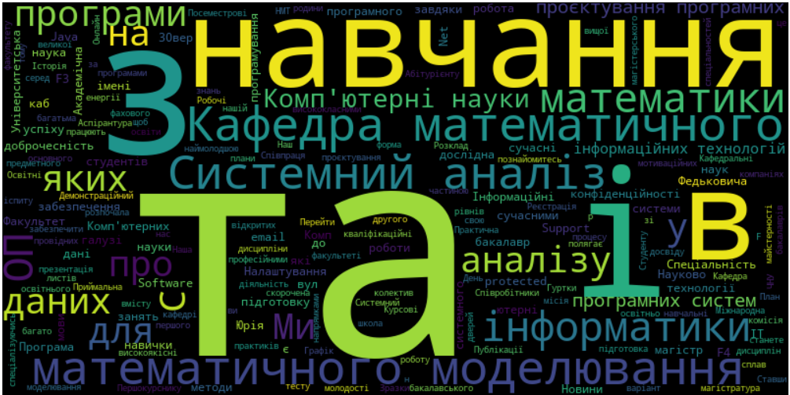


TF (bag-of-words) — приклад побудови словника та матриці частот:
```python
documents = [
        "In Inception, the plot unfolds with thrilling action, keeping audiences on edge through a series of intense and unexpected twists.",
        "The story of Inception keeps audiences hooked with its thrilling action and surprising twists, making every moment unforgettable.",
        "The Matrix transformation preserves the vector's direction, illustrating how linear combinations affect the overall system."
]

document_words = [doc.lower().split() for doc in documents]
vocab = sorted(set(sum(document_words, [])))
vocab_dict = {k: i for i, k in enumerate(vocab)}

import numpy as np
X_tf = np.zeros((len(documents), len(vocab)), dtype=int)
for i, doc in enumerate(document_words):
        for word in doc:
                X_tf[i, vocab_dict[word]] += 1

print(X_tf)
```

Косинусна подібність — простий спосіб виміряти схожість між двома векторними представленнями тексту: $CosineSim(x,y)=\dfrac{x\cdot y}{\|x\|_{2}\|y\|_{2}}$. Вона добре працює для порівняння документів у просторі TF–IDF, але має й обмеження: в такому підході немає розуміння семантики слів, і різні слова, які мають близьке значення, залишаються віддаленими в просторі one‑hot або частотних векторів.

Щоб виправити цю проблему, використовують вбудовування слів (word embeddings) — щільні вектори фіксованого розміру, у яких семантично близькі слова займають близькі позиції у просторі. Моделі на кшталт word2vec або переднавчені матриці типу GloVe навчають векторні представлення таким чином, що арифметичні операції над векторами можуть відображати мовні відношення: наприклад, операція \(\text{king} - \text{man} + \text{woman}\) зазвичай наближається до вектора, близького до \(\text{queen}\). Це відкриває шлях до більш змістовних порівнянь і до знаходження синонімів, антонімів і тематичних зв'язків.

IDF, TF–IDF та косинусна подібність:
```python
idf = np.log(X_tf.shape[0] / X_tf.astype(bool).sum(axis=0))
X_tfidf = X_tf * idf
X_tfidf_norm = X_tfidf / np.linalg.norm(X_tfidf, axis=1)[:, None]
M = X_tfidf_norm @ X_tfidf_norm.T
print('IDF:', idf)
print('TF-IDF matrix:\n', X_tfidf)
print('Cosine similarity matrix:\n', M)
```

Word embeddings (GloVe через gensim.downloader) та приклад аналогій:
```python
import gensim.downloader as api
word_vectors = api.load("glove-wiki-gigaword-100")
vector = word_vectors['computer']
print('vector sample:', vector[:10])
print('similarity woman/man:', word_vectors.similarity('woman', 'man'))

king = word_vectors['king']
man = word_vectors['man']
woman = word_vectors['woman']
result_vector = king - man + woman
print('Analogy results:')
for word, similarity in word_vectors.similar_by_vector(result_vector, topn=5):
        print(word, similarity)
```

TF–IDF і схожість у Gensim (корпус, словник, модель TFIDF, MatrixSimilarity):
```python
import gensim as gs
from gensim.test.utils import lee_corpus_list
from gensim.models import Word2Vec

documents = [
        "kyiv has some excellent new restaurants",
        "kharkiv is a city with great cuisine",
        "postgresql is a relational database management system"
]
document_words = [doc.split() for doc in documents]
dictionary = gs.corpora.Dictionary(document_words)
corpus = [dictionary.doc2bow(doc) for doc in document_words]
tfidf = gs.models.TfidfModel(corpus)
X_tfidf = gs.matutils.corpus2csc(tfidf[corpus])
print(X_tfidf.todense().T)

M = gs.similarities.MatrixSimilarity(tfidf[corpus])
print(M.get_similarities(tfidf[corpus]))
```

Далі стоять мовні моделі, які намагаються оцінити ймовірність слова, враховуючи контекст: $P(word_{i}\mid word_{1},\dots,word_{i-1})$. Простий, але корисний клас таких моделей — n‑грами, що враховують обмежений контекст попередніх $n-1$ слів; їх можна вважати аппроксимацією повної ймовірнісної моделі мови. Сучасні нейронні та трансформерні моделі значно перевершують n‑грами за здатністю захоплювати довготривалі залежності та контекст.

У практиці науковця з даних частина роботи полягає в доборі правильного представлення залежно від задачі: для швидкої класифікації рецензій часто достатньо TF–IDF і лінійних моделей; для складних завдань семантичного пошуку або витягнення сутностей корисні вбудовування слів і контекстні мовні моделі. Важливо пам'ятати, що підготовка даних і прості методи іноді дають вражаючі результати, і вибір інструменту має базуватись на доступності даних, вимогах до точності й обмеженнях по часу на навчання.

## 7. Теорія ймовірності


## 8. Вступ в машинне навчання

Машинне навчання є на даний момент швидкозростаючою галуззю, хоча слід підкреслити, що початкові методи, які ми тут розглянемо (а саме лінійна регресія), з'явилися приблизно на 200 років раніше, ніж сам термін (зазвичай вважається, що Гаусс розробив метод найменших квадратів близько 1800 року). Більшість пізніших методів, про які ми говоримо, були добре вивчені в статистиці на початку століття. Ми все одно будемо використовувати загальний термін «машинне навчання» для позначення всіх цих методів, але важливо знати, що ці ідеї не виникли в спільноті ML. Натомість тема машинного навчання розвинулася завдяки поєднанню трьох різних елементів: 
- зростання обчислювальної потужності (машинне навчання, яке виникло з інформатики, завжди було фундаментально пов'язане з обчислювальними алгоритмами), 
- величезні обсяги доступних даних (сировина для методів машинного навчання) та 
- деякі значні досягнення в галузі алгоритмів, що відбулися за останні 30 років. Однак для початку ми розглянемо деякі з найпростіших алгоритмів, щоб систематизувати основні принципи.

```
import matplotlib.pyplot as plt
import pandas as pd

def build_plot(file_path, x, y):
    data = pd.read_csv(file_path)
    plt.scatter(data[x], data[y], c='blue', marker='x')
    plt.xlabel(x)
    plt.ylabel(y)
    return plt

build_plot('../resources/Salary_dataset.csv', 'YearsExperience', 'Salary').show()
```

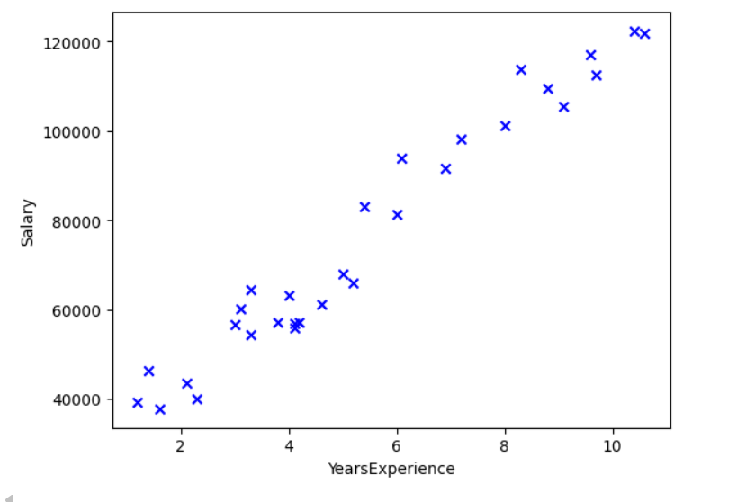

Ось простий приклад залежності між стажем роботи співробітників та їхньою заробітною платою. Чи можна передбачити другий параметр на основі значення першого?

Можна припустити, що залежність відповідає лінійній моделі.

$$y \approx \theta_1 \cdot x + \theta_2$$


Тут 
- $\theta_1$ це “нахил” лінії, та (slope)
- $\theta_2$ зсув. (intercept)

Чи можемо ми робити передбачення даних?

```
import numpy as np

def build_line(plt, theta):
    xlim, ylim =(plt.gca().get_xlim(), plt.gca().get_ylim())
    plt.plot(xlim, [theta[0]*xlim[0]+theta[1], theta[0]*xlim[1]+theta[1]], 'C1')
    plt.xlim(xlim)
    plt.ylim(ylim)

plt = build_plot('../resources/Salary_dataset.csv', 'YearsExperience', 'Salary')
build_line(plt, np.array([9000, 25000]))
```

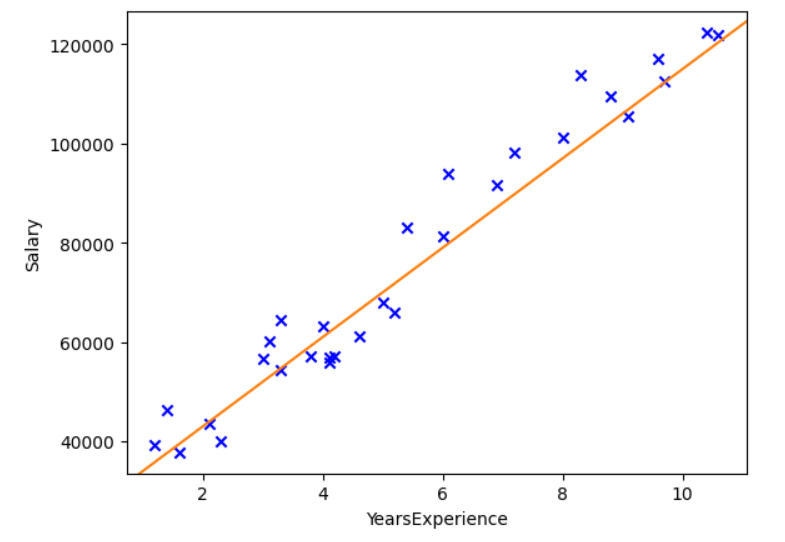


**Градієнтний спуск (Gradient descent)**

Припустимо, що прогнозована зарплата відповідає лінійній моделі. Як ми можемо знайти $\theta$? 

Є багато можливостей, але природною метою є мінімізація деякої різниці між цією лінією 
і спостережуваними даними, наприклад, квадратична втрата:

$$E(\theta) = \sum_{i}(\theta_{1}*x_{i} + \theta_{2} - y_{i} )^{2}$$

Тепер нам потрібно знайти параметри, які мінімізують значення функції $E(\theta)$.

$$minimize_{\theta}E(\theta)$$

Найкращий спосіб знайти значення функції $f(x)$, в якій її значення є мінімальним, — це знайти похідну. Ми починаємо з деякої точки і змінюємо вхідне значення в напрямку від'ємної похідної. У випадку багатозмінних функцій ми будемо використовувати часткові похідні.

Щоб знайти хороше значення $\theta$, ми можемо повторно робити кроки в напрямку 
негативних похідних для кожного значення. Ітерація:

$$ \theta_{1} := \theta_{1} - \alpha \frac{\delta}{\delta \theta_{1}} E(\theta_{1}, \theta_{2})$$

$$ \theta_{2} := \theta_{2} - \alpha \frac{\delta}{\delta \theta_{2}} E(\theta_{1}, \theta_{2})$$

де $\alpha$ — це невелике додатне число, яке називається розміром кроку.
Це алгоритм градієнтного спуску, основа сучасного машинного навчання.

Тут: 

$$\frac{\delta}{\delta \theta_{1}} E(\theta_{1}, \theta_{2}) = \sum_{i}2(\theta_{1}*x_{i} + \theta_{2} - y_{i} )*x_{i}$$

$$\frac{\delta}{\delta \theta_{2}} E(\theta_{1}, \theta_{2}) = \sum_{i}2(\theta_{1}*x_{i} + \theta_{2} - y_{i} )$$

Застосуємо градієнтний спуск до наших даних, спочатку нормалізувавши їх.

```
def build_plot_normalized(file_path, x, y):
    data = pd.read_csv(file_path)
    x_nor = (data[x] - min(data[x])) / (max(data[x]) - min(data[x]))
    y_nor = (data[y] - min(data[y])) / (max(data[y]) - min(data[y]))
    plt.scatter(x_nor, y_nor, c='blue', marker='x')
    plt.xlabel(x)
    plt.ylabel(y)
    return plt

build_plot_normalized('../resources/Salary_dataset.csv', 'YearsExperience', 'Salary').show()
```

Візуалізуємо процес градієнтного спуску.

```
# Visualizing the gradient descent:

def get_data(file_path, x_name, y_name):
    data = pd.read_csv(file_path)
    return data[x_name], data[y_name]

def normalize_data(x):
    x_normalized = (x - min(x)) / (max(x) - min(x))
    return x_normalized

def gradient_descent(x, y, iters, alpha):
    theta = np.array([0., 0.])
    for t in range(iters):
        theta[0] -= alpha/len(x) * 2 * sum((theta[0] * x + theta[1] - y)*x)
        theta[1] -= alpha/len(x) * 2 * sum((theta[0] * x + theta[1] - y) )
    return theta 

def plot_fit(x, y, theta):
    plt.scatter(x, y, marker = 'x')
    xlim, ylim =(plt.gca().get_xlim(), plt.gca().get_ylim())
    plt.plot(xlim, [theta[0]*xlim[0]+theta[1], theta[0]*xlim[1]+theta[1]], 'C1')
    plt.xlim(xlim)
    plt.ylim(ylim) 

x, y = get_data('../resources/Salary_dataset.csv', 'YearsExperience', 'Salary')
x_normalized, y_normalized = normalize_data(x), normalize_data(y)

#first iteration
theta = gradient_descent(x_normalized, y_normalized, 0, 0.1)
plot_fit(x_normalized, y_normalized, theta)
```

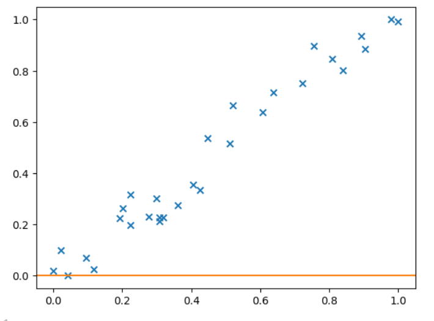

Як бачимо, на першій ітерації значення параметрів $\theta$ віддалені від бажаних. Проведемо іще декілька ітерацій.


```
theta = gradient_descent(x_normalized, y_normalized, 2, 0.1) # change third parameter to see more iterations
plot_fit(x_normalized, y_normalized, theta)
```

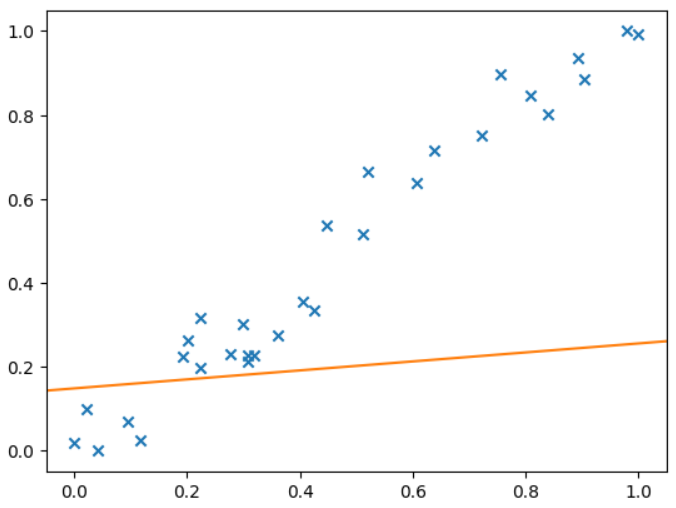

```
theta = gradient_descent(x_normalized, y_normalized, 5, 0.1) # change third parameter to see more iterations
plot_fit(x_normalized, y_normalized, theta)
```

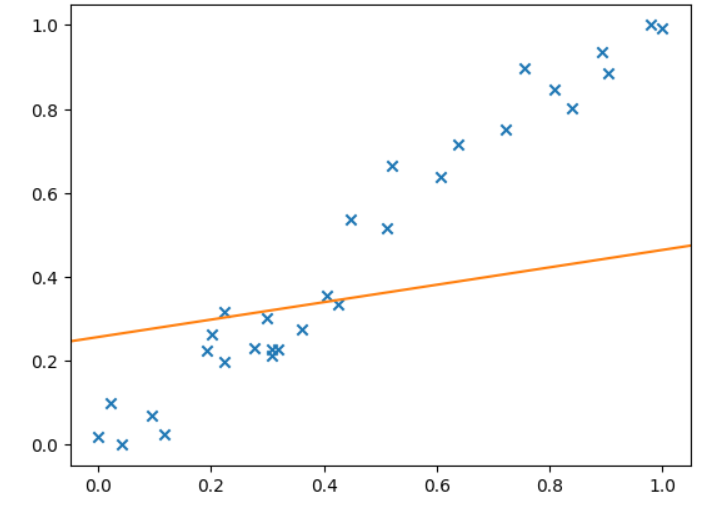

```
theta = gradient_descent(x_normalized, y_normalized, 10, 0.1) # change third parameter to see more iterations
plot_fit(x_normalized, y_normalized, theta)
```

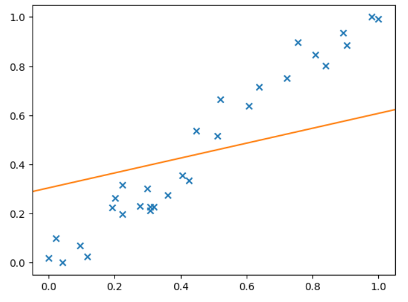

```
theta = gradient_descent(x_normalized, y_normalized, 100, 0.1) # change third parameter to see more iterations
plot_fit(x_normalized, y_normalized, theta)
```

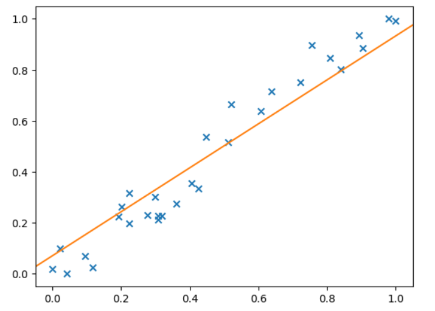

Після 100-ї ітерації ми наблизилися із нашою лінійною моделлю до реального розподілу. 

Ми також можемо візуалізувати процес зміни параметрів $\theta$:

```
# Visualizing parameter updates

def gradient_descent_params(x, y, iters):
    thetas = []
    theta = np.array([0., 0.])
    alpha = 1.0
    for t in range(iters):
        thetas.append(theta.copy())
        theta[0] -= alpha/len(x) * 2 * sum((theta[0] * x + theta[1] - y)*x)
        theta[1] -= alpha/len(x) * 2 * sum((theta[0] * x + theta[1] - y) )
    return np.array(thetas)

def err(x, y, theta):
    return np.mean((np.outer(x, theta[:,0]) + theta[:,1] - y[:,None])**2,axis=0)

thetas = gradient_descent_params(x_normalized, y_normalized, 100)
plt.plot(thetas[:,0], thetas[:,1])
xlim, ylim =(np.array(plt.gca().get_xlim()), np.array(plt.gca().get_ylim()))
xlim += np.array([0,0.5])
ylim += np.array([-0.1, 0.1])

XX,YY = np.meshgrid(np.linspace(xlim[0],xlim[1],200), np.linspace(ylim[0], ylim[1],200))
ZZ = err(x_normalized.to_numpy(), y_normalized.to_numpy(), np.hstack([np.ravel(XX)[:,None], np.ravel(YY)[:,None]])).reshape(XX.shape)
#V = np.logspace(np.log(np.min(ZZ)), np.log(np.max(ZZ)), 30)
V = np.linspace(np.sqrt(np.min(ZZ)), np.sqrt(np.max(ZZ)), 25)**2
plt.clf()
plt.contour(XX,YY,ZZ, V, colors=('C0',))
plt.plot(thetas[:,0], thetas[:,1], 'C1-x')
plt.xlabel("theta1")
plt.ylabel("theta2")
```

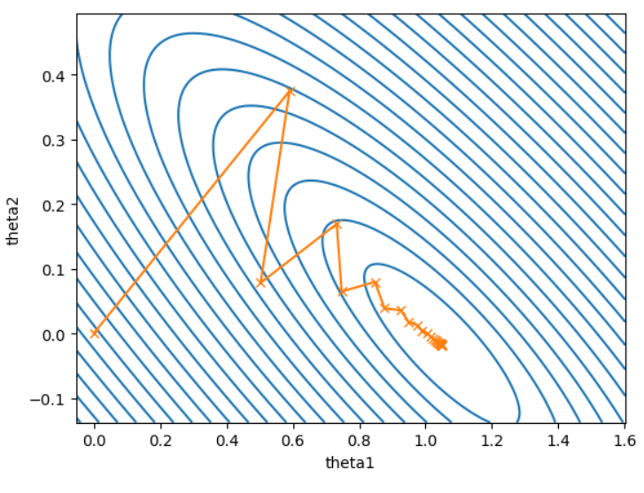

Зробимо те саме лінійне прогнозування, використовуючи бібліотеку scikit-learn:

```
import numpy as np
import matplotlib.pyplot as plt
from sklearn.linear_model import LinearRegression

data = pd.read_csv('../resources/Salary_dataset.csv')
X = np.array(data['YearsExperience']).reshape(-1, 1)  
y = np.array(data['Salary'])                

# етап тренування моделі
model = LinearRegression()
model.fit(X, y)

# отримуємо параметри theta
slope = model.coef_[0]       # theta_1
intercept = model.intercept_ # theta_2 
print("slope:", slope, "intercept:", intercept)

# будуємо лінію 
X_line = np.linspace(X.min(), X.max(), 100).reshape(-1, 1)
y_line = model.predict(X_line)

# plot 
plt.scatter(X, y, c='blue', marker='x')          # початкові дані
plt.plot(X_line, y_line)   # лінія
plt.xlabel("X")
plt.ylabel("y")
plt.title("Linear Regression Fit")
plt.show()
```

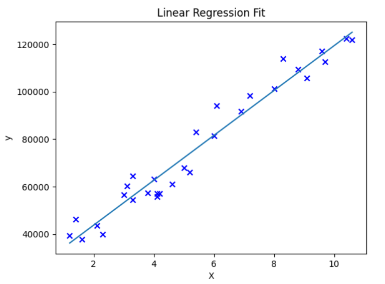


**Трохи більше про машинне навчання.**

Машинне навчання надає можливість автоматично встановлювати прогнозну модель на основі даних.

*Термінологія*. Функція втрат: $l: y × y \rightarrow \mathbb{R}$, вимірює різницю між прогнозом і 
фактичним результатом $$l(y',y)=(y'-y)^{2}$$

Канонічна задача оптимізації машинного навчання:

$$minimize_{\theta}\sum_{i}l(h_{\theta}(x^{i}), y^{i})$$

Практично кожен алгоритм машинного навчання має таку форму, просто вкажіть
- Що таке функція гіпотези?
- Що таке функція втрат?
- Як вирішити задачу оптимізації?

*Приклади алгоритмів машинного навчання*

- Найменші квадрати: лінійна гіпотеза, квадратична втрата, (зазвичай) аналітичне 
рішення.
- Лінійна регресія: лінійна гіпотеза.
- Машина опорних векторів (support vector machine): {лінійна або ядрова гіпотеза, втрата шарніра, *}
- Нейронна мережа: {складена нелінійна функція, *, (зазвичай) градієнтний 
спуск)
- Дерево рішень (decision trees): {ієрархічні півплощини, вирівняні по осі, *, жадібна оптимізація}
- Наївний Байєс: {лінійна гіпотеза, спільна ймовірність за певних 
припущень незалежності, аналітичне рішення}


## 9. Лінійна Класифікація

- Завдання регресії: прогнозування реальної величини $y\in R$
- Завдання класифікації: прогнозування дискретної величини $y$
- Бінарна класифікація: $y\in \{-1,1\}$
- Багатокласова класифікація: $y\in \{1,2,,..., k\}$

**Приклад лінійної класифікації: класифікація раку молочної залози**

Відомий приклад класифікації: використання машинного навчання для діагностики того, чи є 
пухлина молочної залози доброякісною чи злоякісною [Street et al., 1992]

Умови: лікар бере зразок рідини з пухлини, фарбує клітини, а потім окреслює 
декілька клітин (обробка зображення уточнює контури)

Система обчислює характеристики кожної клітини, такі як площа, периметр, увігнутість, текстура 
(всього 10); обчислює середнє/стандартне/максимальне значення для всіх характеристик


```
import numpy as np
import sklearn.datasets
import matplotlib.pyplot as plt
dat = sklearn.datasets.load_breast_cancer()

ix = np.where(dat["feature_names"] == "mean area")[0][0]
iy = np.where(dat["feature_names"] == "mean concave points")[0][0]

def plot_cells():    
    plt.scatter(dat["data"][:,ix][dat["target"]==1], dat["data"][:,iy][dat["target"]==1], marker='x', color='C0')
    plt.scatter(dat["data"][:,ix][dat["target"]==0], dat["data"][:,iy][dat["target"]==0], marker='+', color='C3')
    plt.xlim([0,2600])
    plt.ylim([0,0.21])
    plt.xlabel("Mean Area")
    plt.ylabel("Mean Concave Points")
    plt.legend(['Benign', 'Malignant'])

plot_cells()
```

```

```


```

```

```

```

## 10. Нелінійні Алгоритми Машинного Навчання

До цього моменту ми ілюстрували лінійну регресію як «проведення лінії через дані», 
але насправді це було функцією наших вхідних характеристик.

Хоча це може здаватися обмеженим, алгоритми лінійної регресії є досить потужними, коли застосовуються 
до нелінійних характеристик вхідних даних.

Розглянемо, для прикладу, дані про ріст ВВП Китаю за останні 60 років, і спробуємо побудувати модель, що дає найкраще передбачення.

```python
import matplotlib.pyplot as plt
import pandas as pd

def build_plot(file_path, x, y):
    data = pd.read_csv(file_path)
    plt.scatter(data[x], data[y], c='blue', marker='x')
    plt.xlabel(x)
    plt.ylabel(y)
    return plt
    # plt.show()

build_plot('../resources/china_gdp.csv', 'Year', 'Value').show()
```

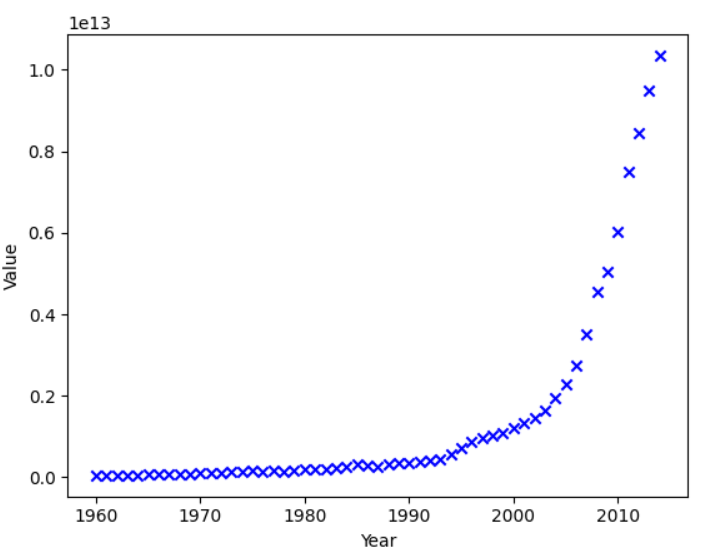

Якщо спробувати провести лінію через цей графік, отримаємо наступне:

```python
plt = build_plot('../resources/china_gdp.csv', 'Year', 'Value')
data = pd.read_csv('../resources/china_gdp.csv')
x, y = data['Year'], data['Value']
x_reshaped, y_reshaped = x.values.reshape(-1, 1), y.values.reshape(-1, 1)

from sklearn.linear_model import LinearRegression
import numpy as np

model = LinearRegression(fit_intercept=True)
model.fit(x_reshaped, y_reshaped)
Xnew = np.array([[2025], [2030]])
print(model.predict(Xnew))

theta = [ model.coef_[0], model.intercept_ ]
print(theta)

X_line = np.linspace(x_reshaped.min(), x_reshaped.max(), 100).reshape(-1, 1)
y_line = model.predict(X_line)

plt.plot(X_line, y_line)
```

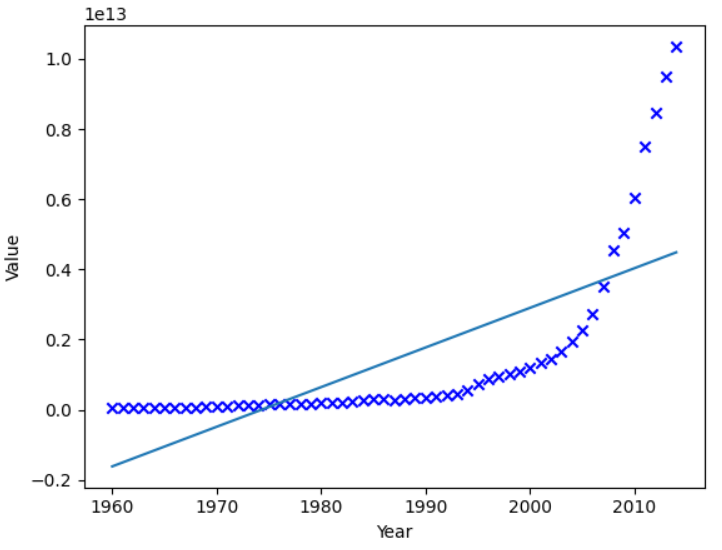

Очевидно, що лінійна модель не найкращим чином наближає ці дані.

**Поліноміальна Регресія**

Поліноміальна регресія — це різновид лінійної регресії, в якому взаємозв’язок між 
$x$ та $y$ моделюється у вигляді полінома $n$-го ступеня:

$$y = \beta_{0} + \beta_{1} x + \beta_{2} x^{2} + ... + \beta_{n} x^{n} + \epsilon$$

Це дозволяє моделювати нелінійні залежності шляхом додавання поліноміальних членів ознак.

```python
import numpy as np
import matplotlib.pyplot as plt
from sklearn.linear_model import LinearRegression
from sklearn.preprocessing import PolynomialFeatures

plt = build_plot('../resources/china_gdp.csv', 'Year', 'Value')
data = pd.read_csv('../resources/china_gdp.csv')
x, y = data['Year'], data['Value']
x_reshaped, y_reshaped = x.values.reshape(-1, 1), y.values.reshape(-1, 1)

# трансформуємо вхідні ознаки в поліноміальні
poly = PolynomialFeatures(degree=5)
X_poly = poly.fit_transform(x_reshaped)

# підбираємо під модель
model = LinearRegression()
model.fit(X_poly, y_reshaped)

# проводимо передбачення та візуалізуємо
X_plot = np.linspace(min(x_reshaped), max(x_reshaped), 100).reshape(-1, 1)
y_pred = model.predict(poly.transform(X_plot))

plt.scatter(x, y, color='blue', label='Data points')
plt.plot(X_plot, y_pred, color='red', label='Polynomial fit')
plt.xlabel("X")
plt.ylabel("y")
plt.title("Polynomial Regression (degree=5)")
plt.legend()
plt.show()

# coefficients
print("Intercept:", model.intercept_)
print("Coefficients:", model.coef_)

```

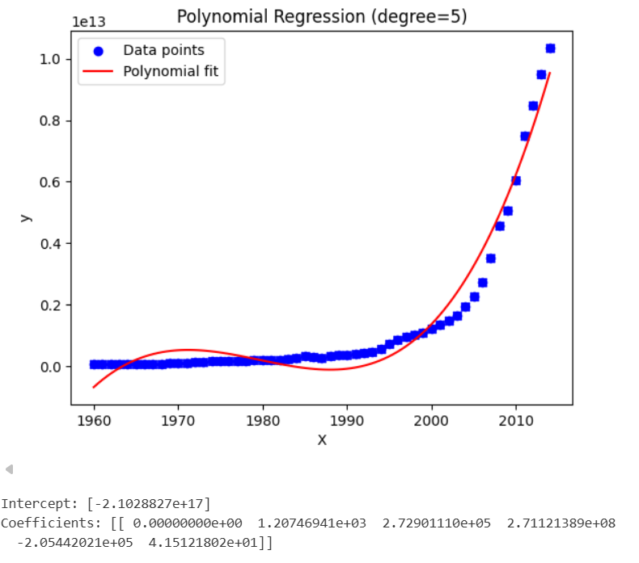


**Узагальнення та перенавчання**

Проблема з канонічною задачею машинного навчання полягає в тому, що нас насправді не цікавить мінімізація цієї цілі на заданому наборі даних.

Нас насправді цікавить, наскільки добре наша функція узагальниться на нових прикладах, які ми не використовували для навчання системи (але які взяті з «того самого розподілу», що й приклади, які ми використовували для навчання)

Поліноми вищого ступеня демонстрували перенавчання: вони фактично мають дуже низькі втрати на даних навчання, але створюють функції, які, як ми очікуємо, не будуть добре узагальнюватися.

У міру ускладнення моделі втрати навчання завжди зменшуються; втрати узагальнення зменшуються до певної точки, а потім починають збільшуватися

Хоча важко кількісно оцінити справжню помилку узагальнення (тобто помилку цих 
алгоритмів щодо повного розподілу можливих прикладів), ми можемо 
наблизити її за допомогою *перехресної валідації*

Основна ідея полягає в тому, щоб розділити набір даних на навчальний набір і набір для перевірки. Навчіть алгоритм на навчальному наборі і оцініть на наборі для перевірки.

Ми називаємо змінні $\theta$ *параметрами* алгоритму машинного навчання.
Але є й інші величини, які також впливають на класифікатор: ступінь полінома, 
кількість регуляризації тощо; їх сукупно називають 
*гіперпараметрами* алгоритму.

Основна ідея перехресного валідації: використовувати навчальний набір для визначення параметрів, використовувати 
резервний набір для визначення гіперпараметрів.


*k-кратна перехресна валідація (k-folds validation):*

Більш складна (але насправді дещо більш поширена) версія перехресної валідації.
Розділіть набір даних на $k$ роз'єднаних підмножин (складок); навчіть на $k-1$ і оцініть на 
залишковій складці; повторіть $k$ разів, утримуючи кожну складку один раз. Повідомте середню похибку для всіх утриманих складок.

*Варіанти*

*Перехресна валідація «залиш один»*: обмеження k-кратної перехресної валідації, де кожна 
складка є лише одним прикладом (тож ми навчаємося на всіх інших прикладах, тестуючи 
цей один приклад)
[Дещо дивно, але для найменших квадратів це можна обчислити ефективніше, ніж k-кратну 
перехресну валідацію, з такою ж складністю вирішення для оптимального 𝜃 за допомогою матричного рівняння] 

*Стратифікована перехресна валідація*: збереження приблизно рівного відсотка 
позитивних/негативних прикладів (або будь-якої іншої ознаки) у кожному згині

*Попередження*: k-кратна перехресна валідація не завжди є кращою (наприклад, у прогнозуванні часових рядів 
бажано, щоб набір утриманих даних був повністю сформований після набору навчання)

**Поліноміальна класифікація.**

Наведемо приклад поліномільної класифікації на тому ж датасеті пухлин молочної залози.

```python
import numpy as np
import matplotlib.pyplot as plt
from sklearn.datasets import load_breast_cancer
from sklearn.preprocessing import PolynomialFeatures, StandardScaler
from sklearn.linear_model import LogisticRegression
from sklearn.model_selection import train_test_split
from sklearn.metrics import ConfusionMatrixDisplay, accuracy_score

# Завантажуємо датасет (лише дві ознаки для класифікації)
data = load_breast_cancer()
X = data.data[:, [3, 25]]  # середній радіус, середній периметр
y = data.target

# Розбиття на тренувальні та тестові дані
X_train, X_test, y_train, y_test = train_test_split(X, y, test_size=0.3, random_state=42)

# Скейлимо дані
scaler = StandardScaler()
X_train_scaled = scaler.fit_transform(X_train)
X_test_scaled = scaler.transform(X_test)

# Додаємо поліноміальні ознаки (нелінійна трансформація)
poly = PolynomialFeatures(degree=10)
X_train_poly = poly.fit_transform(X_train_scaled)
X_test_poly = poly.transform(X_test_scaled)

# Тренуємо логістичну регресію на поліноміальних ознаках
clf = LogisticRegression(max_iter=10000)
clf.fit(X_train_poly, y_train)

# Евалююємо
y_pred = clf.predict(X_test_poly)
print("Accuracy:", accuracy_score(y_test, y_pred))

# Візуалізація (Межа між класами)
x_min, x_max = X_train_scaled[:, 0].min() - 1, X_train_scaled[:, 0].max() + 1
y_min, y_max = X_train_scaled[:, 1].min() - 1, X_train_scaled[:, 1].max() + 1
xx, yy = np.meshgrid(np.linspace(x_min, x_max, 200),
                     np.linspace(y_min, y_max, 200))

Z = clf.predict(poly.transform(np.c_[xx.ravel(), yy.ravel()]))
Z = Z.reshape(xx.shape)

plt.contourf(xx, yy, Z, alpha=0.2, cmap='coolwarm')
plt.scatter(X_test_scaled[:, 0], X_test_scaled[:, 1], c=y_test, cmap='coolwarm', edgecolors='k')
plt.xlabel('mean radius (scaled)')
plt.ylabel('mean perimeter (scaled)')
plt.title('Non-linear Classification with Polynomial Logistic Regression')
plt.show()

# Матриця похибок (confusion matrix)
ConfusionMatrixDisplay.from_predictions(y_test, y_pred, cmap='Blues')
plt.title("Confusion Matrix")
plt.show()
```

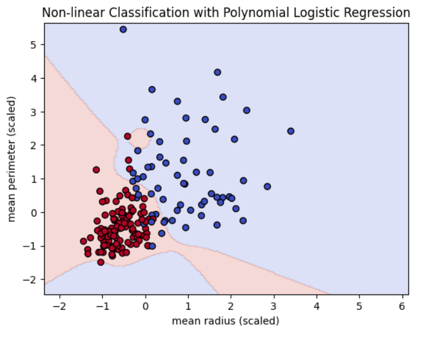


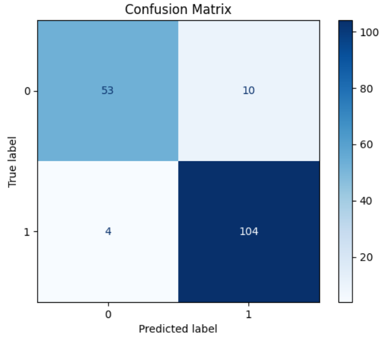


**Метод Опорних Векторів (Support Vector Machine)**

Метод опорних векторів — це алгоритм класифікації, який шукає оптимальну гіперплощину, що розділяє дані двох класів із максимальним зазором (margin).

Нехай ми маємо навчальну вибірку:

$$
{(x_i, y_i)}_{i=1}^n, \quad x_i \in \mathbb{R}^d, \quad y_i \in {-1, +1}
$$

Ми шукаємо гіперплощину, яка має вигляд:

$$
w^T x + b = 0
$$

де

* $w$ — вектор ваг (нормаль до гіперплощини),
* $b$ — зсув (bias).


*Умова коректної класифікації*: Для всіх навчальних точок повинно виконуватись:

$$
y_i (w^T x_i + b) \ge 1
$$

Це означає, що всі точки знаходяться по правильний бік гіперплощини, причому на відстані не менше 1 від неї.

*Відстань (margin)*: Відстань від точки до гіперплощини дорівнює:

$$
\frac{|w^T x + b|}{|w|}
$$

Ми хочемо максимізувати цей зазор між класами.
Для двох крайніх точок зазор дорівнює:

$$
\text{margin} = \frac{2}{|w|}
$$

Отже, щоб його максимізувати, потрібно мінімізувати $|w|^2$.


*Оптимізаційна задача (лінійно роздільний випадок)*:

$$
\begin{aligned}
\min_{w, b} \quad & \frac{1}{2}|w|^2 \
\text{за умови:} \quad & y_i (w^T x_i + b) \ge 1, \quad i = 1, \dots, n
\end{aligned}
$$

Це *опукла квадратична задача оптимізації*.


*Нероздільні дані — м’який зазор*: У реальних даних можливі помилки класифікації, тому вводять змінні послаблення $\xi_i \ge 0$:

$$
\begin{aligned}
\min_{w, b, \xi} \quad & \frac{1}{2}|w|^2 + C \sum_{i=1}^n \xi_i \
\text{за умови:} \quad & y_i (w^T x_i + b) \ge 1 - \xi_i, \quad i = 1, \dots, n
\end{aligned}
$$

де $C > 0$ — параметр, що задає компроміс між шириною зазору та кількістю помилок.


*Ядровий трюк (kernel trick)*: Уявимо собі, що перед нами стоїть така задача: потрібно провести класифікацію температури на комфортну та некомфортну для людини. Якщо для людини комфортною температурою є 20 градусів за Цельсієм, то некомфортною є як -10 так і 40 градусів. Провести таку гіперплощину через ці дані, щоб всі точки з комфортною температурою були з однієї сторони, є неможливим. 

Для того, щоб провести гіперплощину в цьому випадку, ми можемо застосувати перетворення $y(x) = (x-20)^{2}$. Тоді всі некомфортні температури переходять у значення, більші за якесь $a$, тоді як всі комфортні температури відображаються у точки $x\leq a$. Це і є ядровий трюк.

Щоб працювати з нелінійно роздільними даними, SVM використовує перетворення простору:

$$
\phi: \mathbb{R}^d \to \mathbb{R}^m
$$

але замість явного обчислення $\phi(x)$ застосовується ядро $K(x_i, x_j) = \langle \phi(x_i), \phi(x_j) \rangle$.

Типові ядра:

* Лінійне: $K(x, x') = x^T x' $
* Поліноміальне: $K(x, x') = (x^T x' + 1)^d$
* Радіально-базисне (RBF): $K(x, x') = \exp(-\gamma |x - x'|^2) $ - використовується найчастіше.


*Рішення у вигляді опорних векторів*: У результаті оптимізації маємо:

$$
f(x) = \text{sign}\left(\sum_{i=1}^n \alpha_i y_i K(x_i, x) + b\right)
$$

де $\alpha_i$ — коефіцієнти лагранжа.
Точки, для яких $\alpha_i > 0$, називаються *опорними векторами* — саме вони визначають гіперплощину.


*Геометрична інтерпретація*

- SVM шукає межу, яка найбільше віддалена від найближчих точок обох класів.
- Тільки кілька опорних векторів визначають положення цієї межі.

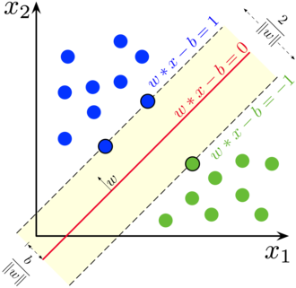


```python
import numpy as np
import matplotlib.pyplot as plt
from sklearn.datasets import load_breast_cancer
from sklearn.preprocessing import StandardScaler
from sklearn.svm import SVC
from sklearn.model_selection import train_test_split
from sklearn.metrics import ConfusionMatrixDisplay, accuracy_score

# Завантажуємо датасет (лише дві ознаки для класифікації)
data = load_breast_cancer()
X = data.data[:, [3, 25]]  # середній радіус, середній периметр
y = data.target

# Розбиття на тренувальні та тестові дані
X_train, X_test, y_train, y_test = train_test_split(X, y, test_size=0.3, random_state=42)

# Скейлимо дані
scaler = StandardScaler()
X_train_scaled = scaler.fit_transform(X_train)
X_test_scaled = scaler.transform(X_test)

# Тренуємо модель SVM із RBF (радіально-базисним) ядром
clf = SVC(kernel='rbf', gamma='scale', C=1.0)
clf.fit(X_train_scaled, y_train)

# Евалююємо
y_pred = clf.predict(X_test_scaled)
print("Accuracy:", accuracy_score(y_test, y_pred))

# Візуалізація (Межа між класами)
x_min, x_max = X_train_scaled[:, 0].min() - 1, X_train_scaled[:, 0].max() + 1
y_min, y_max = X_train_scaled[:, 1].min() - 1, X_train_scaled[:, 1].max() + 1
xx, yy = np.meshgrid(np.linspace(x_min, x_max, 200),
                     np.linspace(y_min, y_max, 200))

Z = clf.predict(np.c_[xx.ravel(), yy.ravel()])
Z = Z.reshape(xx.shape)

plt.contourf(xx, yy, Z, alpha=0.2, cmap='coolwarm')
plt.scatter(X_test_scaled[:, 0], X_test_scaled[:, 1], c=y_test, cmap='coolwarm', edgecolors='k')
plt.xlabel('mean radius (scaled)')
plt.ylabel('mean perimeter (scaled)')
plt.title('Non-linear Classification with SVM (RBF kernel)')
plt.show()

# Матриця похибок (confusion matrix)
ConfusionMatrixDisplay.from_predictions(y_test, y_pred, cmap='Blues')
plt.title("Confusion Matrix")
plt.show()
```

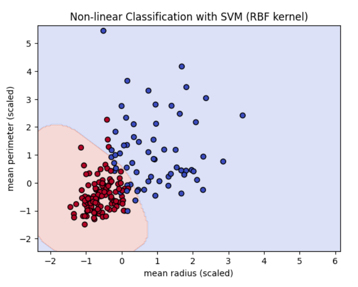


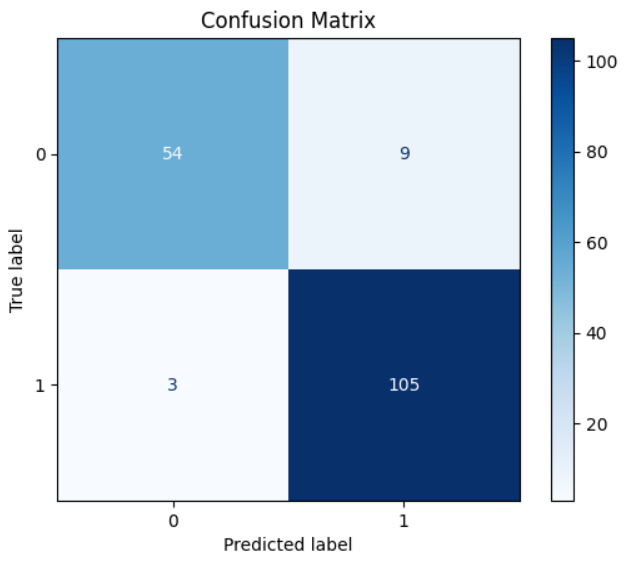


**Наївний баєсів класифікатор (Naive Bayes classifier)**

Наївний баєсівський класифікатор — це ймовірнісний метод класифікації, який базується на теоремі Байєса.
Він оцінює, до якого класу належить об’єкт $ x $, обчислюючи ймовірність $P(C_k | x)$ для кожного класу $C_k$.

Теорема Байєса: основна формула

$$P(C_k | x) = \frac{P(x | C_k) , P(C_k)}{P(x)}$$

де:

* $P(C_k | x)$ — апостеріорна ймовірність класу після спостереження ознак;
* $P(x | C_k)$ — правдоподібність (як імовірно отримати ознаки, якщо відомий клас);
* $P(C_k)$ — апріорна ймовірність класу;
* $P(x)$ — нормувальний коефіцієнт (спільна ймовірність ознак).

*"Наївне" припущення незалежності*: Метод вважає, що всі ознаки $x_1, x_2, \dots, x_n$ незалежні одна від одної, якщо відомо, до якого класу належить об’єкт.

$$P(x | C_k) = \prod_{j=1}^n P(x_j | C_k)$$

Це *"наївне" припущення* значно спрощує обчислення, навіть якщо насправді ознаки частково залежать.

*Формула класифікації:* Підставимо у формулу Байєса:

$$
P(C_k | x) \propto P(C_k) \prod_{j=1}^n P(x_j | C_k)
$$

Оскільки $ P(x) $ однакова для всіх класів, її можна не враховувати при порівнянні.

Отже, ми вибираємо клас з максимальною апостеріорною ймовірністю:

$$
\hat{C} = \arg\max_{C_k} ; P(C_k) \prod_{j=1}^n P(x_j | C_k)
$$


```python
import numpy as np
import matplotlib.pyplot as plt
from sklearn.datasets import load_breast_cancer
from sklearn.preprocessing import StandardScaler
from sklearn.naive_bayes import GaussianNB
from sklearn.model_selection import train_test_split
from sklearn.metrics import ConfusionMatrixDisplay, accuracy_score

# Завантажуємо датасет (лише дві ознаки для класифікації)
data = load_breast_cancer()
X = data.data[:, [3, 25]]  # середній радіус, середній периметр
y = data.target

# Розбиття на тренувальні та тестові дані
X_train, X_test, y_train, y_test = train_test_split(
    X, y, test_size=0.3, random_state=42
)

# Скейлимо дані
scaler = StandardScaler()
X_train_scaled = scaler.fit_transform(X_train)
X_test_scaled = scaler.transform(X_test)

# Тренуємо Gaussian Naive Bayes модель
clf = GaussianNB()
clf.fit(X_train_scaled, y_train)

# Евалююємо
y_pred = clf.predict(X_test_scaled)
print("Accuracy:", accuracy_score(y_test, y_pred))

# Візуалізація (Межа між класами)
x_min, x_max = X_train_scaled[:, 0].min() - 1, X_train_scaled[:, 0].max() + 1
y_min, y_max = X_train_scaled[:, 1].min() - 1, X_train_scaled[:, 1].max() + 1
xx, yy = np.meshgrid(
    np.linspace(x_min, x_max, 200),
    np.linspace(y_min, y_max, 200)
)

Z = clf.predict(np.c_[xx.ravel(), yy.ravel()])
Z = Z.reshape(xx.shape)

plt.contourf(xx, yy, Z, alpha=0.2, cmap='coolwarm')
plt.scatter(X_test_scaled[:, 0], X_test_scaled[:, 1], c=y_test, cmap='coolwarm', edgecolors='k')
plt.xlabel('mean radius (scaled)')
plt.ylabel('mean perimeter (scaled)')
plt.title('Classification with Gaussian Naive Bayes')
plt.show()

# Матриця похибок (confusion matrix)
ConfusionMatrixDisplay.from_predictions(y_test, y_pred, cmap='Blues')
plt.title("Confusion Matrix")
plt.show()

```

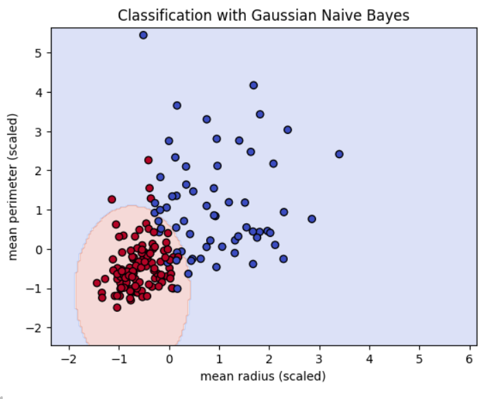


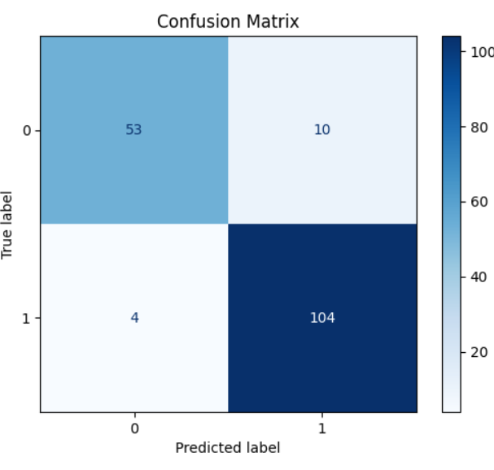


**Дерева прийняття рішень (Decision trees)**

Алгоритм дерева прийняття рішень використовується для класифікації або регресії.
Його ідея — розділяти простір ознак на підмножини так, щоб отримати групи об’єктів, максимально однорідні за цільовою змінною.

Дерево прийняття рішень — це ієрархічна структура, де:
- вузол (node) містить умову розділення (наприклад, $x_{i} < t$)
- гілки (branches) — це варіанти переходу (так/ні);
- листки (leaves) — фінальні рішення (клас або числове значення)

Маємо навчальну вибірку:

$$
{(x_i, y_i)}_{i=1}^n, \quad x_i \in \mathbb{R}^d, ; y_i \in {1, 2, \dots, K}
$$

Мета — знайти функцію $ f(x) $, яка розбиває простір ознак на області $ R_m $, і кожній області відповідає передбачення класу:

$$
f(x) = \sum_{m=1}^{M} c_m \cdot I(x \in R_m)
$$

де:

* $ R_m $ — регіон (листок дерева);
* $c_m $ — значення або клас, який передбачається для цього регіону;
* $ I(\cdot) $ — індикаторна функція (1, якщо умова виконується).

На кожному кроці вибирається ознака $ x_j $ та поріг $ t $, які найкраще поділяють дані на дві частини:

$$
R_1(j, t) = {x \mid x_j \le t}, \quad R_2(j, t) = {x \mid x_j > t}
$$

Ми вибираємо такі $j, t$, що мінімізують певну функцію втрат $L$.

Тут можна навести приклад із класифікацією пацієнтів за ризиком серцевих захворювань. Нехай перед нами стоїть задача класифікувати пацієнтів таким чином. Тут логічно будувати дерево, в якому на вузлах пацієнти будуть розділятися за віком (вік, більший за певне число - підвищений ризик), вагою (вага, більша за певне число - також ризик захворювань), та схильністю до куріння. Питання лише в підборі конкретних чисел (гранична вага та вік) таким чином, щоб мінімізувати ентропію (пацієнти, що будуть неправильно класифіковані). 

Як бачимо, дерево прийняття рішень є цілком інтуїтивно зрозумілим алгоритмом, а значною перевагою цієї моделі є її інтерпретованість.

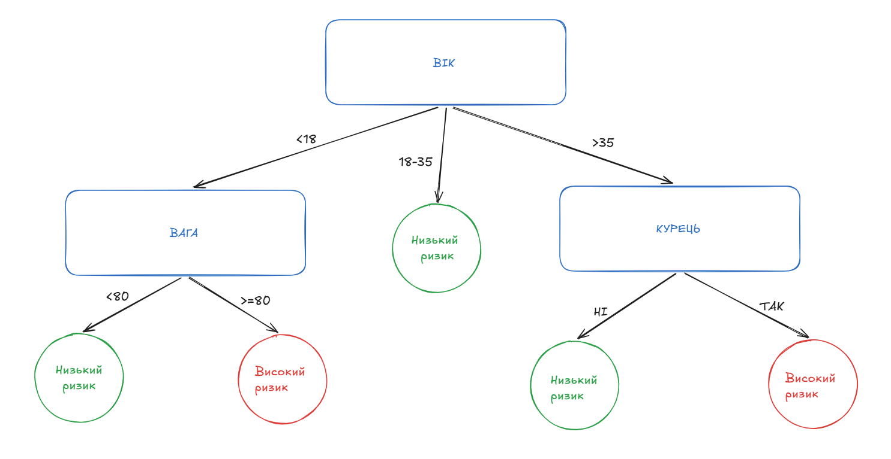

Приклад з використанням sklearn:

```python
import numpy as np
import matplotlib.pyplot as plt
from sklearn.datasets import load_breast_cancer
from sklearn.tree import DecisionTreeClassifier, plot_tree
from sklearn.model_selection import train_test_split

# Завантажуємо датасет
data = load_breast_cancer()

# Вибираємо тільки дві ознаки: під індексом 3 та 25
X = data.data[:, [3, 25]]
y = data.target

# Розділяємо дані на тренувальні та тестові
X_train, X_test, y_train, y_test = train_test_split(X, y, test_size=0.3, random_state=42)

# Навчаємо модель
clf = DecisionTreeClassifier(max_depth=5, criterion='gini', random_state=42)
clf.fit(X_train, y_train)

# Точність
print("Accuracy on test set:", clf.score(X_test, y_test))

# Будуємо межу розподілу класів
x_min, x_max = X[:, 0].min() - 0.01, X[:, 0].max() + 0.01
y_min, y_max = X[:, 1].min() - 0.01, X[:, 1].max() + 0.01
xx, yy = np.meshgrid(np.linspace(x_min, x_max, 300),
                     np.linspace(y_min, y_max, 300))

Z = clf.predict(np.c_[xx.ravel(), yy.ravel()])
Z = Z.reshape(xx.shape)

plt.figure(figsize=(10, 6))
plt.contourf(xx, yy, Z, alpha=0.3, cmap=plt.cm.RdYlBu)
scatter = plt.scatter(X[:, 0], X[:, 1], c=y, cmap=plt.cm.RdYlBu, edgecolor='k', s=50)

plt.xlabel(data.feature_names[3])
plt.ylabel(data.feature_names[25])
plt.title("Decision Tree Classifier (Depth=3)")
# plt.legend(handles=scatter.legend_elements()[0], labels=data.target_names)
plt.show()

# Будуємо дерево прийняття рішень
plt.figure(figsize=(14, 8))
plot_tree(clf, feature_names=[data.feature_names[3], data.feature_names[25]],
          class_names=data.target_names, filled=True, rounded=True)
plt.title("Decision Tree Structure (2 features)")
plt.show()
```

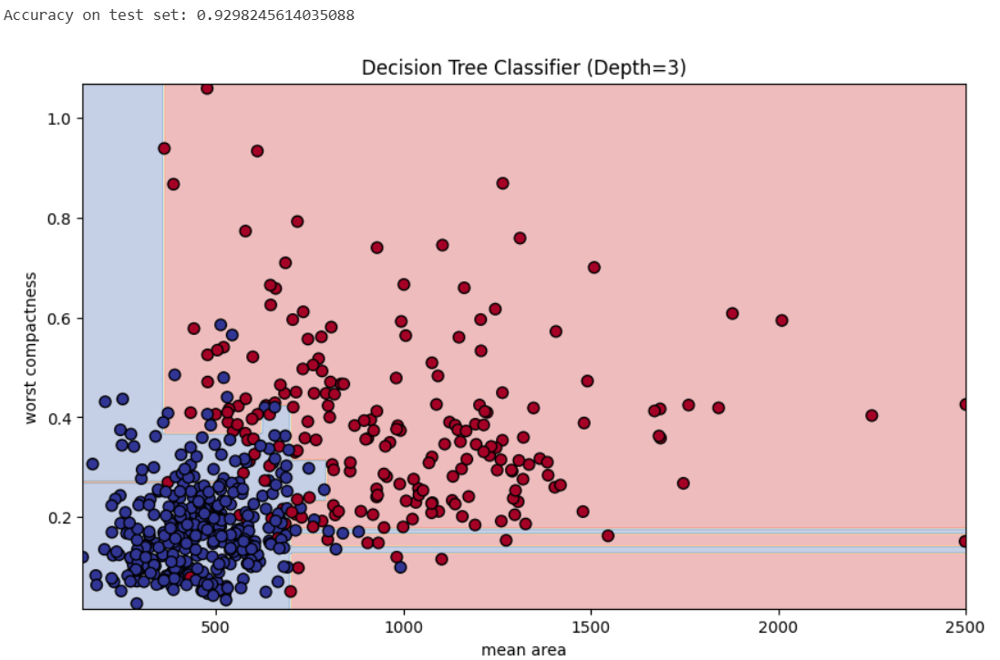


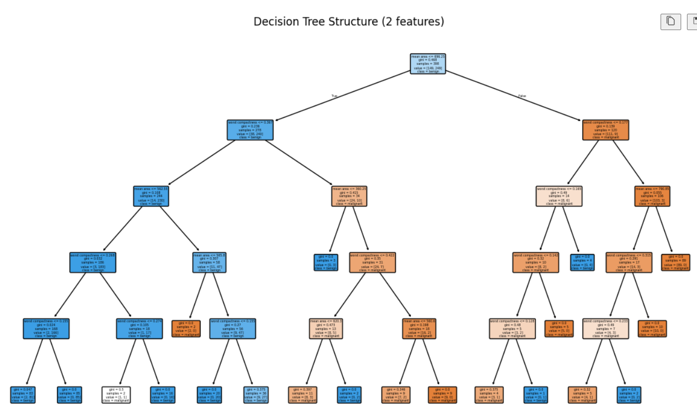


## 11. Ансамблеве навчання

Якщо ми використовуємо для прогнозування лише одну модель, вона може мати доволі таки високу варіативність - будь-яка зміна вхідних даних буде призводити до іншого результату. Саме тому в нагоді стає ідея використання набору моделей.

Ансамблеве навчання — техніка машинного навчання, що використовує кілька навчених алгоритмів з метою отримати кращу передбачальну ефективність, ніж можна отримати від кожного алгоритму окремо. На відміну від статистичного ансамблю в статистичній механіці, який зазвичай нескінченний, ансамбль моделей у машинному навчанні складається з конкретної скінченної множини альтернативних моделей, але зазвичай дозволяє існувати істотно гнучкішим структурам.

Ідея ансамблів полягає в тому, що замість того, щоб покладатися на одну "думку", ми беремо багато моделей і об'єднуємо їхні прогнози. Тут можна навести аналогію з людьми - уявіть, що потрібно оцінити кількість монет в прозорій банці (нам відомо, що цих монет там 100). Одна людина може дуже сильно помилитися і назвати, наприклад, число `400`. Але якщо запитати 100 людей: `400, 50, 150, 70, 200, 40, ...`, то середнє значення часто виявляється набагато ближчим до істини. 

**Випадковий ліс**

Випадковий ліс — це ансамблевий метод класифікації або регресії, який об’єднує велику кількість дерев рішень, кожне з яких навчається на випадковій підмножині даних і ознак.
Ідея полягає в тому, щоб зменшити перенавчання (overfitting), властиве окремим деревам, і отримати більш стабільну та точну модель.


Нехай маємо навчальну вибірку:
$$
D = {(x_i, y_i)}_{i=1}^{N}, \quad x_i \in \mathbb{R}^m, ; y_i \in {1, 2, \dots, K}
$$

Алгоритм випадкового лісу створює $ T $ незалежних дерев рішень:

$$
\text{RandomForest} = { h_1(x), h_2(x), \dots, h_T(x) }
$$

Після побудови всіх дерев $ h_t(x) $, прогноз робиться голосуванням (для класифікації):

$$
\hat{y} = \text{mode}{ h_1(x), h_2(x), \dots, h_T(x) }
$$

або усередненням (для регресії):

$$
\hat{y} = \frac{1}{T} \sum_{t=1}^{T} h_t(x)
$$

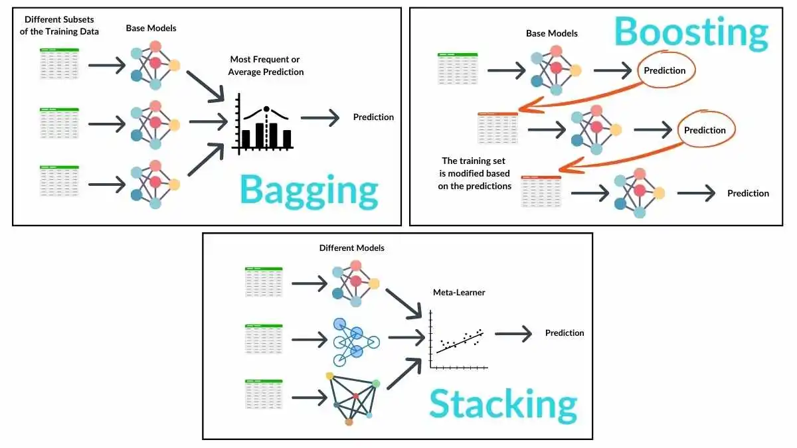

```python
import numpy as np
import matplotlib.pyplot as plt
from sklearn.datasets import load_breast_cancer
from sklearn.model_selection import train_test_split
from sklearn.ensemble import RandomForestClassifier
from sklearn.preprocessing import StandardScaler
from sklearn.metrics import ConfusionMatrixDisplay, accuracy_score

# Завантажуємо датасет
data = load_breast_cancer()
X = data.data[:, [3, 25]]  
y = data.target

# Розподіл на тренувальні та тестові дані
X_train, X_test, y_train, y_test = train_test_split(
    X, y, test_size=0.3, random_state=42
)

# Скейлимо ознаки
scaler = StandardScaler()
X_train_scaled = scaler.fit_transform(X_train)
X_test_scaled = scaler.transform(X_test)

# Тренуємо Random Forest
clf = RandomForestClassifier(
    n_estimators=100, max_depth=5, random_state=42
)
clf.fit(X_train_scaled, y_train)

# Оцінка моделі
y_pred = clf.predict(X_test_scaled)
print("Accuracy:", accuracy_score(y_test, y_pred))

# Візуалізація
x_min, x_max = X_train_scaled[:, 0].min() - 1, X_train_scaled[:, 0].max() + 1
y_min, y_max = X_train_scaled[:, 1].min() - 1, X_train_scaled[:, 1].max() + 1
xx, yy = np.meshgrid(
    np.linspace(x_min, x_max, 300),
    np.linspace(y_min, y_max, 300)
)

Z = clf.predict(np.c_[xx.ravel(), yy.ravel()])
Z = Z.reshape(xx.shape)

plt.figure(figsize=(8, 6))
plt.contourf(xx, yy, Z, alpha=0.3, cmap='coolwarm')
plt.scatter(X_test_scaled[:, 0], X_test_scaled[:, 1],
            c=y_test, cmap='coolwarm', edgecolors='k', s=50)
plt.xlabel(data.feature_names[3])
plt.ylabel(data.feature_names[25])
plt.title("Random Forest Classifier Decision Boundary")
plt.show()

# Матриця похибок
ConfusionMatrixDisplay.from_predictions(y_test, y_pred, cmap='Blues')
plt.title("Random Forest Confusion Matrix")
plt.show()
```

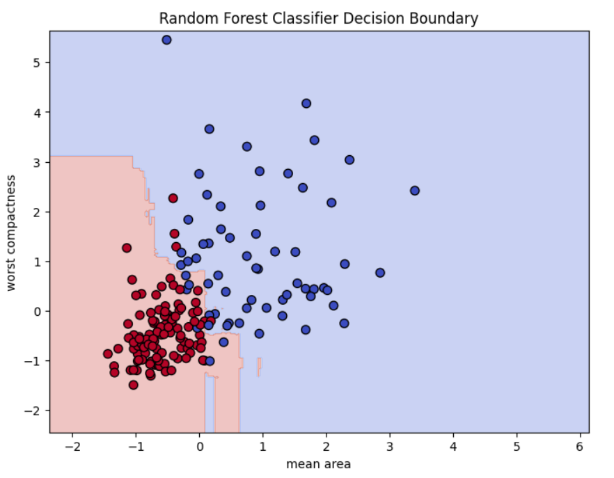

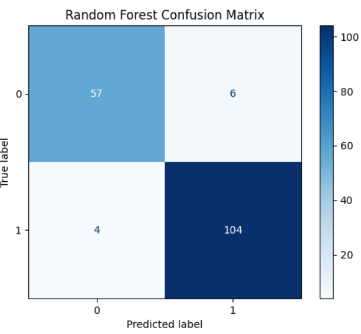

**XGBoost (Extreme Gradient Boosting)**

XGBoost — це ансамблевий метод машинного навчання, заснований на градієнтному бустингу дерев рішень. На відміну від випадкового лісу, де дерева будуються незалежно одне від одного, в XGBoost кожне нове дерево навчається виправляти помилки попередніх дерев.

Нехай маємо навчальну вибірку:

$D = {(x_i, y_i)}_{i=1}^{N}, \quad x_i \in \mathbb{R}^m$

Модель будується послідовно як сума дерев рішень:

$F_T(x) = \sum_{t=1}^{T} f_t(x)$

де $f_t(x)$

— $t$-те дерево рішень, а $T$ — загальна кількість дерев.

На першій ітерації модель може складатися лише з одного дерева:

$F_1(x) = f_1(x)$

На кожній наступній ітерації додається нове дерево, яке апроксимує залишки (помилки) поточної моделі:

$F_t(x) = F_{t-1}(x) + f_t(x)$

Для задач регресії залишки визначаються як:

$r_i^{(t)} = y_i - F_{t-1}(x_i)$

У загальному випадку XGBoost мінімізує функцію втрат:

$$
\mathcal{L}^{(t)}
=
\sum_{i=1}^{N}
l(y_i,\hat y_i^{(t)})
+
\sum_{k=1}^{t}
\Omega(f_k)
$$

де $l(y_i,\hat y_i)$ — функція втрат (наприклад MSE або LogLoss), а $\Omega(f)$ — регуляризаційний доданок для боротьби з перенавчанням.

Для побудови нового дерева використовується градієнтний розклад функції втрат:

$$
g_i =
\frac{\partial l(y_i,\hat y_i)}
{\partial \hat y_i}
$$

$$
h_i =
\frac{\partial^2 l(y_i,\hat y_i)}
{\partial \hat y_i^2}
$$

де $g_i$ та $h_i$ є відповідно першим та другим похідними функції втрат.

Після побудови всіх дерев прогноз моделі має вигляд:

$$
\hat y =
\sum_{t=1}^{T}
f_t(x)
$$

Для задач класифікації отримане значення додатково пропускається через логістичну функцію:

$$
P(y=1|x)
=
\frac{1}
{1+e^{-\hat y}}
$$

та клас визначається за максимальним значенням ймовірності.

```python
import numpy as np
import matplotlib.pyplot as plt
from sklearn.datasets import load_breast_cancer
from sklearn.model_selection import train_test_split
from sklearn.preprocessing import StandardScaler
from sklearn.metrics import ConfusionMatrixDisplay, accuracy_score
from xgboost import XGBClassifier

# Завантажуємо датасет
data = load_breast_cancer()
X = data.data[:, [3, 25]]  # mean smoothness, worst concave points
y = data.target

# Розподіл на тренувальні та тестові дані
X_train, X_test, y_train, y_test = train_test_split(
    X, y, test_size=0.3, random_state=42
)

# Скейлимо дані
scaler = StandardScaler()
X_train_scaled = scaler.fit_transform(X_train)
X_test_scaled = scaler.transform(X_test)

# Тренування XGBoost classifier
clf = XGBClassifier(
    n_estimators=200,
    max_depth=4,
    learning_rate=0.1,
    subsample=0.8,
    colsample_bytree=0.8,
    use_label_encoder=False,
    eval_metric='logloss',
    random_state=42
)
clf.fit(X_train_scaled, y_train)

# Передбачення та оцінка моделі
y_pred = clf.predict(X_test_scaled)
print("Accuracy:", accuracy_score(y_test, y_pred))

# Візуалізація
x_min, x_max = X_train_scaled[:, 0].min() - 1, X_train_scaled[:, 0].max() + 1
y_min, y_max = X_train_scaled[:, 1].min() - 1, X_train_scaled[:, 1].max() + 1
xx, yy = np.meshgrid(
    np.linspace(x_min, x_max, 300),
    np.linspace(y_min, y_max, 300)
)

Z = clf.predict(np.c_[xx.ravel(), yy.ravel()])
Z = Z.reshape(xx.shape)

plt.figure(figsize=(8, 6))
plt.contourf(xx, yy, Z, alpha=0.3, cmap='coolwarm')
plt.scatter(X_test_scaled[:, 0], X_test_scaled[:, 1],
            c=y_test, cmap='coolwarm', edgecolors='k', s=50)
plt.xlabel(data.feature_names[3])
plt.ylabel(data.feature_names[25])
plt.title("XGBoost Classifier Decision Boundary")
plt.show()

# Матриця похибок
ConfusionMatrixDisplay.from_predictions(y_test, y_pred, cmap='Blues')
plt.title("XGBoost Confusion Matrix")
plt.show()
```


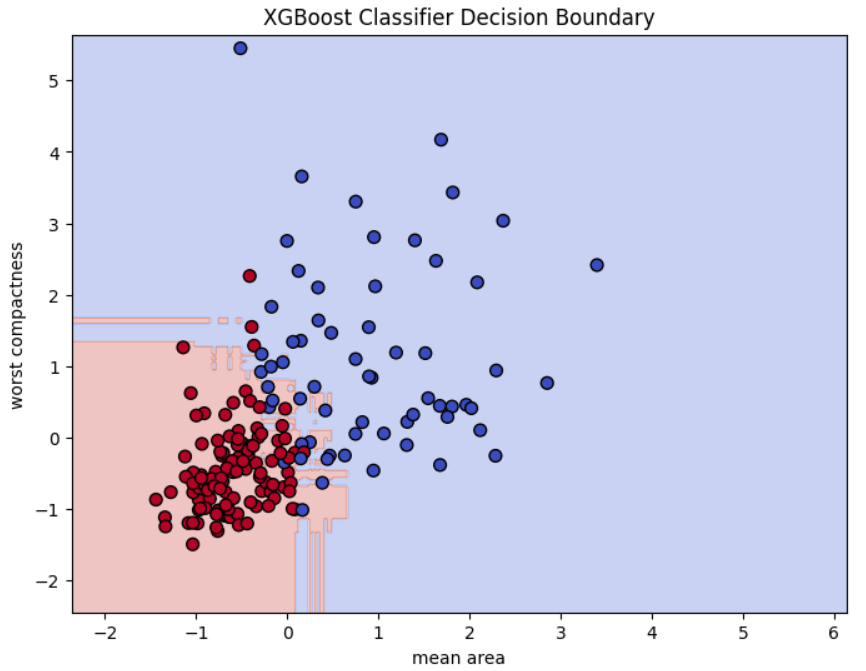

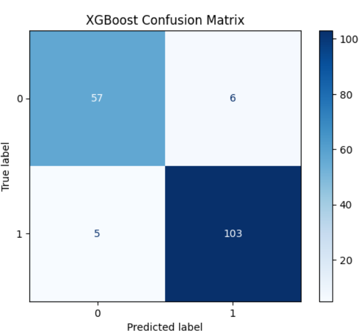


**Компроміс зсуву та дисперсії (Bias–variance tradeoff)**

Мета будь-якої моделі машинного навчання — знайти закономірність у даних, щоб робити точні передбачення.
Однак модель може:

- бути занадто простою (недонавченою, underfitting)
- або занадто складною (перенавченою, overfitting)

Цей баланс описує компроміс між зсувом і дисперсією.

| Компонента               | Формула                                                                          | Пояснення                                                                                                   |
| ------------------------ | -------------------------------------------------------------------------------- | ----------------------------------------------------------------------------------------------------------- |
| *Зсув (Bias)*          | $\text{Bias}[\hat{f}(x)] = \mathbb{E}[\hat{f}(x)] - f(x) $                      | Наскільки “в середньому” модель відхиляється від істинної залежності. Великий зсув → модель занадто проста. |
| *Дисперсія (Variance)* | $ \text{Var}[\hat{f}(x)] = \mathbb{E}[(\hat{f}(x) - \mathbb{E}[\hat{f}(x)])^2] $ | Наскільки модель “чутлива” до зміни навчальних даних. Велика дисперсія → модель перенавчається.             |
| *Невідворотний шум*    | $ \sigma^2 = \text{Var}(\varepsilon) $                                          | Частина похибки, яку неможливо усунути, бо вона спричинена випадковими факторами в даних.                   |

Мета навчання — знайти модель, у якій Bias² + Variance мінімальні (шум ми не контролюємо).

Варто запам'ятати, що в переважній більшості випадків, bagging ансамблеві моделі( наприклад, Випадковий Ліс) - зменшують дисперсію (variance), а boosting (XGBoost) - зменшують зсув (bias).

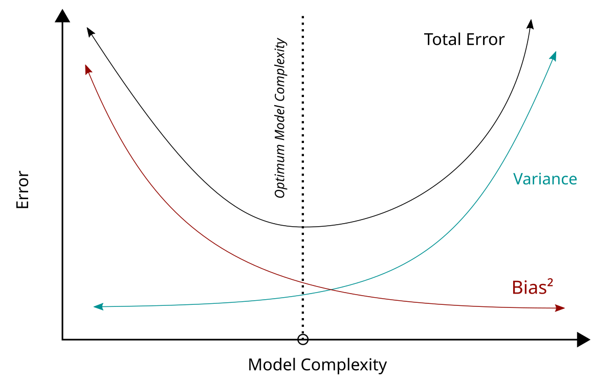


## 12. Навчання без учителя (Unsupervised Learning)

**Кластеризація методом к–середніх (k-means clustering)**

Метод k–середніх — це один із найпопулярніших алгоритмів некерованого навчання (unsupervised learning), який використовується для розбиття даних на $k$ кластерів так, щоб об’єкти всередині одного кластера були схожими між собою, а між різними кластерами — максимально відрізнялися.

Нехай маємо вибірку з $ n $ об’єктів:

$$
X = {x_1, x_2, \ldots, x_n}, \quad x_i \in \mathbb{R}^d
$$

де $ d $ — кількість ознак (вимірів).

Ми хочемо розбити множину $ X $ на $ k $ кластерів:

$$
C_1, C_2, \ldots, C_k
$$

так, щоб мінімізувати суму квадратів відстаней точок до центрів своїх кластерів.

Алгоритм мінімізує наступну функцію вартості (відомо як *within-cluster sum of squares*, WCSS):

$$
J = \sum_{j=1}^{k} \sum_{x_i \in C_j} |x_i - \mu_j|^2
$$

де:

- $ \mu_j $ — центр (середнє) кластера $ C_j $:
  $$
  \mu_j = \frac{1}{|C_j|} \sum_{x_i \in C_j} x_i
  $$
- $ |x_i - \mu_j|^2 $ — квадрат евклідової відстані між точкою та центром кластера.

Алгоритм ітеративний і складається з таких кроків:

1. Ініціалізація:   Вибрати випадковим чином $ k $ початкових центрів кластерів $ \mu_1, \mu_2, \ldots, \mu_k $.

2. Крок призначення (Assignment step):
   Для кожної точки ( x_i ) визначити найближчий центр:
   $$
   c_i = \arg \min_{j \in {1,\ldots,k}} |x_i - \mu_j|^2
   $$
   Тобто точка належить до того кластера, чий центр ближчий.

3. Крок оновлення центрів (Update step)
   Для кожного кластера $ C_j $ оновити центр як середнє всіх точок цього кластера:
   $$
   \mu_j = \frac{1}{|C_j|} \sum_{x_i \in C_j} x_i
   $$

4. Перевірка зупинки:   Алгоритм зупиняється, коли центри кластерів перестають змінюватися або зміни стають незначними.


Згенеруємо в python набір даних із трьох нормальних розподілів.

```python
import numpy as np
import matplotlib.pyplot as plt

X = m,n = (1000,2)
np.random.seed(0)
X = 0.4*np.random.randn(m,n)
Mu0 = np.array([[0,-2], [-1,1], [1,1]])
X += Mu0[np.random.choice(np.arange(3), m),:]
plt.scatter(X[:,0], X[:,1])
```

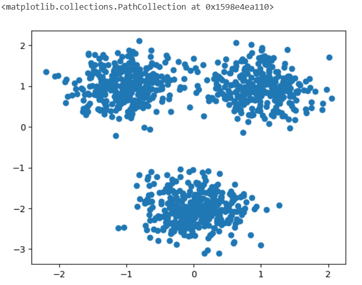

Приклад виконання алгоритму k-середніх на даному датасеті:


```python
import numpy as np
import matplotlib.pyplot as plt
from sklearn.cluster import KMeans

# застосуємо k-середніх
kmeans = KMeans(n_clusters=3, random_state=42)
labels = kmeans.fit_predict(X)
centers = kmeans.cluster_centers_

# візуалізація
plt.figure(figsize=(8, 5))
plt.scatter(X[:, 0], X[:, 1], c=labels, cmap='viridis', s=60, edgecolors='k', alpha=0.7)
plt.scatter(centers[:, 0], centers[:, 1], c='red', s=200, marker='X', label='Centroids')
plt.title('K-Means Clustering Example')
plt.xlabel('Feature 1')
plt.ylabel('Feature 2')
plt.legend()
plt.grid(True)
plt.show()
```

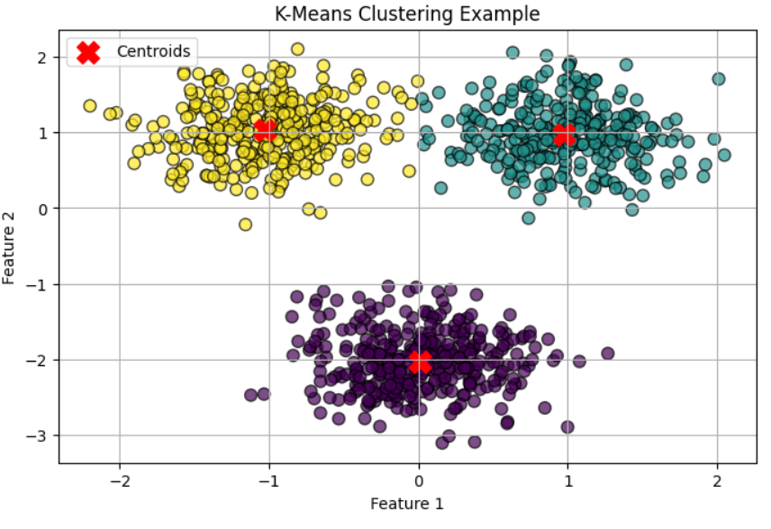


**Метод головних компонент (PCA)**

Метод головних компонент (PCA) — це статистичний метод зменшення розмірності даних.
Його ідея полягає в тому, щоб знайти нову систему координат, де:

- перша вісь (перша головна компонента) пояснює максимальну дисперсію даних,

- друга — наступну за величиною дисперсію, і т. д.
Так при збереженні головних компонент ми зберігаємо максимум інформації при мінімумі вимірів.


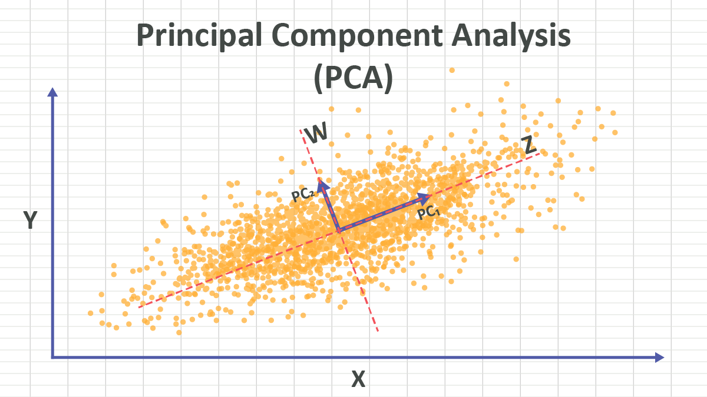

Застосуємо алгоритм головних компонент на відомий нам датасет раку молочної залози. Завантажимо дані та виведемо розмірність.

```python
import pandas as pd 
import numpy as np 
from sklearn.datasets import load_breast_cancer 

cancer = load_breast_cancer(as_frame=True) 
# створюємо датафрейм 
df = cancer.frame 
print('Original Dataframe shape :',df.shape) # вхідні ознаки
X = df[cancer['feature_names']] 
print('Inputs Dataframe shape :', X.shape)
```


```
Original Dataframe shape : (569, 31)
Inputs Dataframe shape : (569, 30)
```

30 вхідних ознак потрібно спроектувати на 2 головні ознаки.


```python
X_mean = X.mean()
X_std = X.std()
X_normalized = (X - X_mean) / X_std # нормалізуємо дані
```

Побудуємо матрицю коваріацій

```python
c = X_normalized.cov() 

import matplotlib.pyplot as plt 
import seaborn as sns 
sns.heatmap(c) 
plt.show()
```

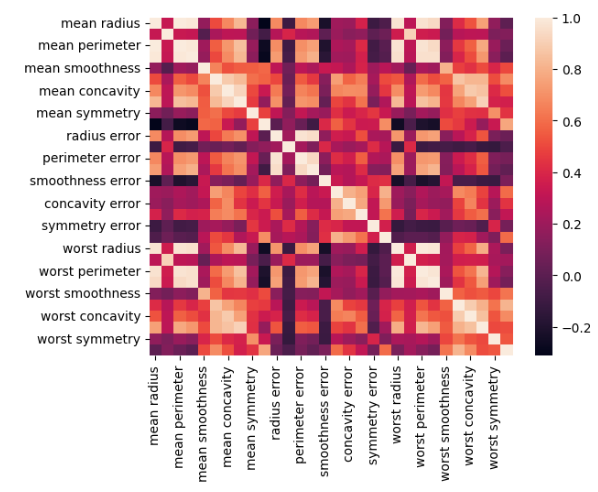

Знайдемо на основі даних про коваріацію власні значення - власні значення матриці коваріації.

```python
eigenvalues, eigenvectors = np.linalg.eig(c) 
print('Eigen values:\n', eigenvalues) 
print('Eigen values Shape:', eigenvalues.shape) 
print('Eigen Vector Shape:', eigenvectors.shape)
```


```
Eigen values:
 [1.32816077e+01 5.69135461e+00 2.81794898e+00 1.98064047e+00
 1.64873055e+00 1.20735661e+00 6.75220114e-01 4.76617140e-01
 4.16894812e-01 3.50693457e-01 2.93915696e-01 2.61161370e-01
 2.41357496e-01 1.57009724e-01 9.41349650e-02 7.98628010e-02
 5.93990378e-02 5.26187835e-02 4.94775918e-02 1.33044823e-04
 7.48803097e-04 1.58933787e-03 6.90046388e-03 8.17763986e-03
 1.54812714e-02 1.80550070e-02 2.43408378e-02 2.74394025e-02
 3.11594025e-02 2.99728939e-02]
Eigen values Shape: (30,)
Eigen Vector Shape: (30, 30)
```


```python
# Проіндексуємо власні значення в порядку спадання
idx = eigenvalues.argsort()[::-1] 
eigenvalues = eigenvalues[idx] # відповідно відсортуємо і власні вектори
eigenvectors = eigenvectors[:,idx]
```


```python
explained_var = np.cumsum(eigenvalues) / np.sum(eigenvalues) 
print(explained_var)
```


```
[0.44272026 0.63243208 0.72636371 0.79238506 0.84734274 0.88758796
 0.9100953  0.92598254 0.93987903 0.95156881 0.961366   0.97007138
 0.97811663 0.98335029 0.98648812 0.98915022 0.99113018 0.99288414
 0.9945334  0.99557204 0.99657114 0.99748579 0.99829715 0.99889898
 0.99941502 0.99968761 0.99991763 0.99997061 0.99999557 1.        ]
```


```python
n_components = np.argmax(explained_var >= 0.50) + 1 
print(n_components)
```


```
2
```


```python
# PCA компоненти
u = eigenvectors[:,:n_components] 
pca_component = pd.DataFrame(u, index = cancer['feature_names'], columns = ['PC1','PC2'] ) 

# будуємо heatmap 
plt.figure(figsize =(5, 7)) 
sns.heatmap(pca_component) 
plt.title('PCA Component') 
plt.show()
```

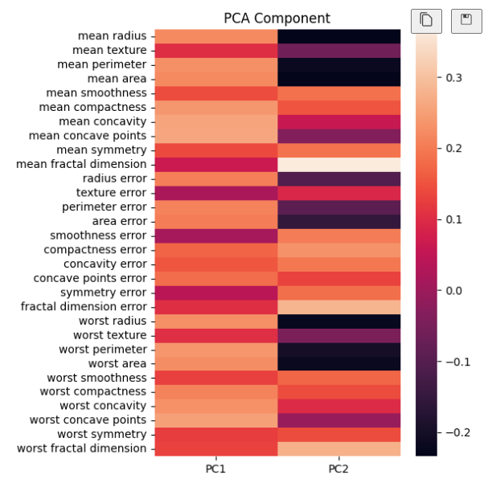


```python
# Множимо матриці нормалізованих даних на PCA компоненти
Z_pca = X_normalized @ pca_component 
Z_pca.rename({'PC1': 'PCA1', 'PC2': 'PCA2'}, axis=1, inplace=True) 
print(Z_pca)
```


```
          PCA1       PCA2
0     9.184755   1.946870
1     2.385703  -3.764859
2     5.728855  -1.074229
3     7.116691  10.266556
4     3.931842  -1.946359
..         ...        ...
564   6.433655  -3.573673
565   3.790048  -3.580897
566   1.255075  -1.900624
567  10.365673   1.670540
568  -5.470430  -0.670047

[569 rows x 2 columns]
```


Тепер той же самий алгоритм, але використовуємо модуль sklearn.

```python
from sklearn.decomposition import PCA

pca = PCA(n_components=2)
pca.fit(X_normalized)
x_pca = pca.transform(X_normalized)

df_pca1 = pd.DataFrame(x_pca, columns=['PC{}'. format(i+1) for i in range(n_components)]) 
print(df_pca1)

# Будуємо графік
plt.figure(figsize=(8, 6)) 
plt.scatter(x_pca[:, 0], x_pca[:, 1], c=cancer['target'], cmap='plasma') 
plt.xlabel('First Principal Component') 
plt.ylabel('Second Principal Component') 
plt.show()
```


```
           PC1        PC2
0     9.184755   1.946870
1     2.385703  -3.764859
2     5.728855  -1.074229
3     7.116691  10.266556
4     3.931842  -1.946359
..         ...        ...
564   6.433655  -3.573673
565   3.790048  -3.580897
566   1.255075  -1.900624
567  10.365673   1.670540
568  -5.470430  -0.670047

[569 rows x 2 columns]
```

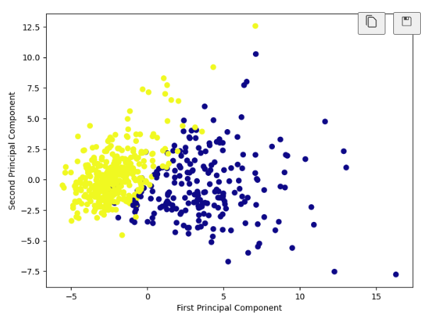


## 13. Перевірка статистичних гіпотез (Hypothesis testing)

**Перевірка гіпотез** — це фундаментальний статистичний метод, який використовується в науці про дані для формування висновків або узагальнень про популяцію на основі вибіркових даних. Він допомагає нам визначити, чи є спостережуваний ефект у наборі даних статистично значущим, чи він міг виникнути випадково.

У науці про дані перевірка гіпотез використовується в різних сферах, зокрема в A/B-тестуванні, регресійному аналізі та оцінці моделей машинного навчання.


**Ключові поняття в тестуванні гіпотез**

Нульова гіпотеза ($H_0$): Нульова гіпотеза — це твердження про відсутність ефекту або різниці. Вона слугує базовим або вихідним припущенням. Наприклад, в A/B-тесті нульова гіпотеза може стверджувати, що дві групи мають однакову середню продуктивність.

Альтернативна гіпотеза ($H_1$): Альтернативна гіпотеза є протилежною нульовій гіпотезі. Вона передбачає, що існує статистично значущий ефект або різниця. Наприклад, альтернативна гіпотеза може стверджувати, що група A має вищий середній показник, ніж група B.

Тестова статистика: Тестова статистика — це стандартизоване значення, обчислене на основі вибіркових даних, яке використовується для оцінки сили доказів проти нульової гіпотези. До поширених тестових статистик належать t-оцінки та z-оцінки.

P-значення: P-значення представляє ймовірність отримання тестової статистики, що є принаймні такою ж екстремальною, як і спостережувана, припускаючи, що нульова гіпотеза є правдивою. Мале P-значення (зазвичай менше 0,05) вказує на сильні докази проти нульової гіпотези.

Рівень значущості (α): Рівень значущості (часто позначається як α) — це поріг, обраний аналітиком для прийняття рішення про відхилення нульової гіпотези. Зазвичай α встановлюється на рівні 0,05, що означає 5% ймовірність відхилення нульової гіпотези, коли вона є справжньою (помилка I типу).

Помилки типу I та типу II:

Помилка типу I: Неправильне відхилення нульової гіпотези, коли вона є істинною (хибнопозитивний результат).
Помилка типу II: Невідхилення нульової гіпотези, коли вона є хибною (хибнонегативний результат).
Потужність тесту: Потужність тесту — це ймовірність правильного відхилення нульової гіпотези, коли вона є хибною. Висока потужність означає менший ризик помилки типу II.


**Приклад**: У нас є ігровий кубик (гральна кістка).
Ми підозрюємо, що він “підкручений” — тобто шістка випадає частіше, ніж мала б.

Ми кидаємо кубик 60 разів, і отримуємо:

кількість шісток: 15

- Нульова гіпотеза $H_0$: кубик чесний
  $$
  p = \frac{1}{6} \approx 0.1667
  $$

- Альтернативна гіпотеза $H_1$: кубик “підкручений на шістку”
  $$
  p > \frac{1}{6}
  $$

(Тобто — односторонній тест.)

Випадкова величина -  Позначимо:
$$
X = \text{кількість шісток у 60 кидках}
$$
Тоді:
$$
X \sim \text{Binomial}(n = 60, p = 1/6)
$$

Очікуване значення та дисперсія тоді будуть наступні:

$$
\mathbb{E}[X] = n p = 60 \times \frac{1}{6} = 10
$$
$$
\mathrm{Var}(X) = n p (1 - p) = 60 \times \frac{1}{6} \times \frac{5}{6} \approx 8.33
$$
$$
\sigma = \sqrt{8.33} \approx 2.89
$$

Наближено нормальний тест - для (n=60) можна використати нормальне наближення:
$$
Z = \frac{X - \mathbb{E}[X]}{\sigma} = \frac{15 - 10}{2.89} \approx 1.73
$$

Рівень значущості - візьмемо рівень $\alpha = 0.05$.
Критичне значення для одностороннього тесту:
$$
Z_{кр} = 1.645
$$

Прийняття рішення - оскільки $Z = 1.73 > 1.645$, то ми відхиляємо (H_0) на рівні значущості 0.05.

Отже, є статистичні підстави вважати, що кубик дійсно “підкручений” на шістку. Це одновибірковий біноміальний тест.


**Перевірка гіпотез у машинному навчанні**

У машинному навчанні перевірка гіпотез відіграє важливу роль в оцінці моделей. Наприклад, при порівнянні двох моделей (наприклад, дерева рішень і випадкового лісу) можна використовувати перевірку гіпотез, щоб оцінити, чи є різниця в продуктивності (наприклад, точність, прецизійність) статистично значущою.

Типовим сценарієм є використання перехресного валідації для навчання моделей на різних підмножинах даних, а потім виконання статистичного тесту (наприклад, парного t-тесту) для визначення, чи одна модель постійно перевершує іншу.


**Практичний приклад: A/B-тестування з перевіркою гіпотез**

Уявіть ситуацію, коли компанія, що займається електронною комерцією, хоче перевірити, чи новий дизайн веб-сайту (B) приносить більше покупок, ніж поточний дизайн (A). Компанія проводить A/B-тестування і збирає дані про кількість покупок, зроблених користувачами, які відвідують кожну версію сайту.

Етапи:

- Нульова гіпотеза ($H_0$): новий дизайн не впливає на рівень покупок (тобто немає різниці між A і B).
- Альтернативна гіпотеза ($H_1$): новий дизайн збільшує рівень покупок.
- Рівень значущості: Встановіть α = 0,05.
- Збір даних: Припустимо, ви зібрали такі дані:
- Версія A: 500 відвідувачів, 50 покупок.
- Версія B: 600 відвідувачів, 80 покупок.
- Проведення тесту: Використовуйте z-тест для порівняння частоти покупок між двома групами.
- Висновок: На основі p-значення відхиліть або не відхиліть нульову гіпотезу.

Наведемо деякі приклади статистичних перевірок.

**Одновибірковий t-критерій (One-sample t-test)**

Нехай у нас є дані про ріст студентів. Нашим припущенням є те, що є певний середній ріст студентів (у прикладі нижче - 183 сантиметри). Проведемо одновибірковий t-критерій, щоб перевірити цю гіпотезу

```python
# імпортуємо пакети
import scipy.stats as stats 
import numpy as np
  
data = [182, 180, 190, 184]
  
# проводимо one sample t-test 
t_statistic, p_value = stats.ttest_1samp(a=data, popmean=183) 
print(t_statistic , p_value)
```

```
0.46291004988627577 0.6749411569291093
```

Оскільки $p = 0.675 > 0.05$, ми не можемо відхилити нульову гіпотезу. Отримані дані не дають статистично значущих підстав стверджувати, що середній зріст відрізняється від 183 см.

Інакше кажучи, вибірка $182, 180, 190, 184$ узгоджується з припущенням про середнє значення 183.


**Однофакторний дисперсійний аналіз (One-way ANOVA)**


```python
# Візьмемо дані з трьох незалежних груп
group1 = [2.9, 3.0, 2.5, 2.6, 3.2, 2.8]
group2 = [3.8, 2.7, 4.0, 3.9, 3.2, 3.1]
group3 = [3.1, 3.4, 3.7, 3.0, 3.1, 3.6]

# Проводимо one-way ANOVA
f_statistic, p_value = stats.f_oneway(group1, group2, group3)

print(f"F-statistic: {f_statistic}")
print(f"P-value: {p_value}")
```

```
F-statistic: 4.434477379095165
P-value: 0.03068555150519455
```

Оскільки $p = 0.0307 < 0.05$ нульова гіпотеза відхиляється. Існують статистично значущі відмінності між середніми значеннями хоча б двох груп.

**Одновибірковий критерій хі-квадрат (англ. One-sample Chi-Squared test)**

Застосуємо одновибірковий критерій хі-квадрат до нашого прикладу із гральним кубиком.

```python
# Розподіл результатів кидків грального кубика - від 1 до 6
observed = np.array([30, 10, 5, 5, 5, 5])  

avg = observed.sum()

expected = np.array([avg/6, avg/6, avg/6, avg/6, avg/6, avg/6])

# Проводимо one-sample Chi-Square goodness of fit test
chi2_stat, p_value = stats.chisquare(f_obs=observed, f_exp=expected)

print(f"Chi-Square Statistic: {chi2_stat}")
print(f"P-value: {p_value}")
```

```
Chi-Square Statistic: 50.0
P-value: 1.3857973367009573e-09
```

Оскільки $p << 0.05$ нульова гіпотеза впевнено відхиляється. Отриманий розподіл практично неможливо пояснити випадковими коливаннями - ігровий кубик є зваженим.

**Критерій незалежності хі-квадрат (Chi-Square Test of Independence)**

```python
# Приклад даних: таблиця співвідношень зі спостережуваними частотами
# Наприклад, це можуть бути дані про вподобання споживачів щодо двох брендів у різних вікових групах.
observed = np.array([[1,2,2,5],
                     [1, 3, 2, 1]])

# Проводимо Chi-Square Test of Independence
chi2_stat, p_value, dof, expected = stats.chi2_contingency(observed)

print(f"Chi-Square Statistic: {chi2_stat}")
print(f"P-value: {p_value}")
print(f"Degrees of Freedom: {dof}")
print(f"Expected Frequencies:\n{expected}")
```

```
Chi-Square Statistic: 2.412380952380953
P-value: 0.49133407367391724
Degrees of Freedom: 3
Expected Frequencies:
[[1.17647059 2.94117647 2.35294118 3.52941176]
 [0.82352941 2.05882353 1.64705882 2.47058824]]
```

Оскільки $p = 0.491 > 0.05$, ми не можемо відхилити нульову гіпотезу. Статистично значущого зв'язку між віковою групою та вибором бренду не виявлено.

Спостережувані відмінності можуть бути пояснені випадковими коливаннями вибірки.


| **Тип даних / Кількість груп**    | **1 група**                                                                  | **2 групи**                                                                 | **2 і більше груп**                                                    |
| :-------------------------------- | :--------------------------------------------------------------------------- | :-------------------------------------------------------------------------- | :--------------------------------------------------------------------- |
| **Категоріальні дані**            | Тест для частки (наближення Z-критерієм)<br>Критерій хі-квадрат              | Тест для частки (наближення Z-критерієм)<br>Критерій хі-квадрат             | Критерій хі-квадрат                                                    |
| **Неперервні дані**               | Z-критерій та його варіанти<br>T-критерій та його варіанти                   | Z-критерій та його варіанти<br>T-критерій та його варіанти                  | Дисперсійний аналіз ANOVA (F-критерій, однофакторний або двофакторний) |
| **Порушення класичних припущень** | Знаковий критерій (Sign Test)<br>Критерій знакових рангів (Signed Rank Test) | Критерій Вілкоксона–Манна–Уїтні<br>Парний t-критерій<br>Критерій Мак-Немара | Критерій Краскела–Уолліса                                              |


## 14. Рекомендаційні системи (Recommender Systems)


## 15. Часові Ряди

## 16. Моделювання Кризових Явищ

## 17. Використання нейронних мереж для аналізу даних

